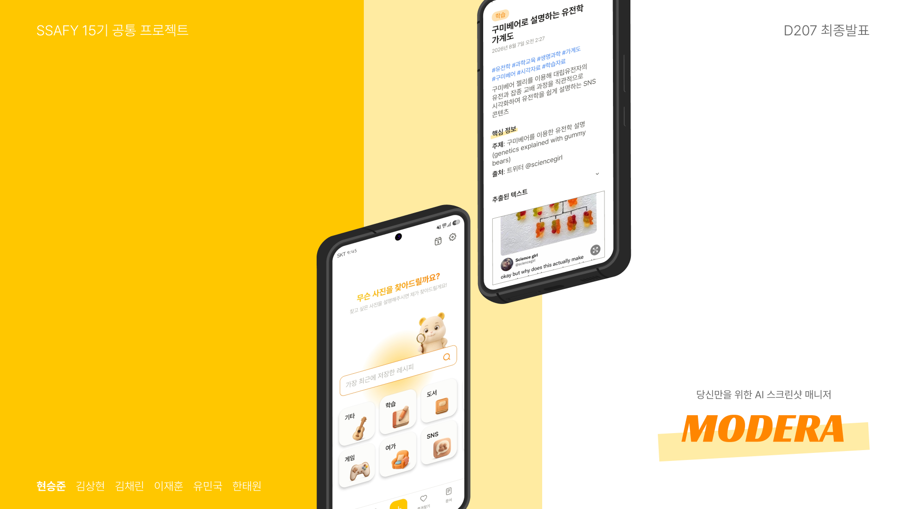

# MODERA - AI 기반 스크린샷 지식 관리 서비스

- 기간: 2026.07.21 ~ 2026.08.22
- 팀 구성/역할
    - 김상현 : Backend
    - 김채린 : Android
    - 유민국 : Android
    - 이재훈 : AI
    - 한태원 : Backend
    - 현승준 : AI

---

## 1. 개요

MODERA는 갤러리에 쌓여만 가는 스크린샷을 **AI가 알아서 분석·분류하고, 필요할 때 말로 찾아주는** 개인 지식 관리 서비스입니다.

핵심 가치는 **"찍기만 하세요, 정리와 검색은 MODERA가 합니다"** 입니다.

스크린샷은 가장 빠른 저장 수단이지만, 가장 다시 찾기 어려운 저장 수단이기도 합니다. MODERA는 스크린샷을 올리는 순간 내용을 읽고, 제목·요약·태그를 붙이고, 카테고리로 분류하고, 일정까지 뽑아 캘린더에 넣을 수 있게 해줍니다.

### ✨ 주요 특징

- **🤖 AI 자동 분석·분류**: Gemini 멀티모달 분석으로 제목·요약·태그 생성, 카테고리 자동 분류(기본 13종 + 사용자 맞춤 카테고리 자동 생성·병합)
- **🔍 자연어 검색**: "지난달에 캡처한 노트북 최저가" 같은 문장으로 검색 — BM25(한국어 형태소 분석 nori) + 시맨틱 kNN(bge-m3)을 RRF로 결합한 하이브리드 검색
- **🖼️ 연관 이미지 추천**: 임베딩 벡터(pgvector) 기반으로 지금 보는 스크린샷과 관련된 이미지를 함께 제시
- **📄 문서 생성**: 흩어진 스크린샷 여러 장을 골라 하나의 마크다운 문서로 자동 정리
- **📅 일정 추출**: 스크린샷 속 날짜·시간을 AI가 인식해 일정 후보로 제안, 기기 캘린더에 등록
- **🔔 푸시 알림 + 증분 동기화**: 분석이 끝나면 FCM으로 알리고, WorkManager가 바뀐 데이터만 동기화하는 오프라인 우선(offline-first) 구조

### 👥 타겟 사용자

**스크린샷으로 정보를 모으는 모든 사람**

- 쇼핑 최저가, 공지, 티켓, 레시피를 일단 캡처해두는 스마트폰 사용자
- 캡처는 많이 하지만 갤러리에서 다시 찾은 적은 거의 없는 사람
- 모아둔 자료를 정리된 문서나 일정으로 활용하고 싶은 학생·직장인

### 🎨 서비스 컨셉

**"캡처하는 순간 정리되는 나만의 스크린샷 서랍"**

**📱 플랫폼**

: Android 네이티브 앱 (Jetpack Compose)

**🛠️ 주요 기술**

: Spring Boot(2-서버 SOA) · Redis Streams · FastAPI · Gemini · OpenSearch(nori + kNN) · PostgreSQL(pgvector) · MinIO · Docker · Jenkins

---

## 2. 기획 의도 / 배경

### "이런 경험, 있으신가요?"

- 📱 세일 정보를 캡처해두고 **세일이 끝난 뒤에 발견함**
- 🔍 분명히 찍어둔 스크린샷인데 **갤러리를 아무리 내려도 안 보임**
- 📅 예매 내역을 캡처해놓고 **일정을 캘린더에 옮기는 걸 깜빡함**
- 📚 스크린샷은 수백 장인데 **정리된 건 한 장도 없음**

스크린샷은 "나중에 보려고" 찍지만, 갤러리는 시간순으로만 쌓일 뿐 내용을 모릅니다. 파일명도, 태그도, 검색도 없는 이미지 더미 속에서 필요한 한 장을 찾는 일은 결국 처음부터 다시 스크롤하는 일이 됩니다.

### MODERA는

- 찍어서 공유하기만 하면 알아서 올라간다. (수집의 편리)
- 내용을 읽고 제목·태그·카테고리를 붙여준다. (분류의 편리)
- 기억나는 대로 말하면 찾아준다. (검색의 편리)
- 모은 자료를 문서와 일정으로 바꿔준다. (활용의 편리)

---

## 3. 프로젝트 구성

```
S15P11D207/
├─ backend/                        # Spring Boot 멀티모듈 (2-서버 SOA)
│  ├─ api-server/                  # 회원·인증, 이미지 등록, 보관함, 조회·검색 API
│  ├─ analysis-worker/             # 분석 이벤트 소비 → AI 호출 → 결과 저장·발행
│  ├─ event-contract/              # 두 서버가 공유하는 유일한 모듈 (이벤트 DTO·상수)
│  └─ local-infra/                 # 로컬 개발용 docker-compose 스택
│
├─ ai/
│  └─ ai_main/                     # FastAPI AI 서버 (분석 파이프라인·검색·문서 생성)
│
├─ frontend/
│  └─ modera/                      # Android 앱 (Compose 멀티모듈, 30개 모듈)
│
├─ infra/                          # 운영 배포 (compose, Jenkins, Nginx, 모니터링)
│
└─ exec/                           # 포팅 매뉴얼, 외부 서비스, 환경변수, DB 덤프
```

---

## 4. 기술 스택

### ▣ Android

- **Language / UI**: Kotlin 2.3, Jetpack Compose (Material3, Navigation 3, 탭별 독립 백스택)
- **Architecture**: Now-in-Android 스타일 멀티모듈(30개: app / core 12 / feature 18) + Convention Plugin(build-logic)
- **DI**: Hilt
- **Network**: Retrofit 3, OkHttp 5, Sandwich, kotlinx-serialization (토큰 자동 갱신 Authenticator)
- **Local Data**: Room, Proto DataStore (오프라인 우선 캐시, 최근 검색어)
- **Sync / Push**: WorkManager 증분 동기화, Firebase Cloud Messaging
- **On-device AI**: ML Kit Text Recognition(한국어 OCR)
- **UI/UX**: Coil, Lottie, Markwon(마크다운 렌더링)
- **Auth**: Kakao SDK (카카오 로그인)

### ▣ BE

- **Language / Framework**: Java 21, Spring Boot 4.0.2 (멀티모듈: api-server / analysis-worker / event-contract)
- **Architecture**: 2-서버 SOA — 두 서버는 Redis Streams 이벤트로만 통신, DB·스키마 완전 분리
- **Spring**: Spring Security(JWT), Spring Data JPA + QueryDSL, JdbcTemplate(vector·JSONB 타입)
- **DB**: PostgreSQL (pgvector 유사도 검색, pg_bigm 텍스트 검색, schema 4개 논리 분리), Liquibase 마이그레이션
- **Messaging**: Redis Streams (Consumer Group + XACK, at-least-once + 멱등 처리, PEL 회수 배치)
- **Storage**: MinIO (S3 호환) — Presigned URL 직접 업로드, ObjectCreated webhook
- **Push**: Firebase Admin SDK (FCM)
- **문서화 / 테스트**: Swagger(SpringDoc), k6 부하 테스트

### ▣ AI

- **Framework**: Python 3.12, FastAPI + Uvicorn, Pydantic v2
- **LLM**: Gemini 2.5 Flash(메타데이터 생성·정보성 판정), 2.5 Flash-Lite(비전 분석·질의 파싱), 3.5 Flash(문서 생성) — 기능별 모델 분리로 비용 최적화
- **Embedding**: gemini-embedding-2(768차원, 카테고리 판정·연관 이미지) + BAAI/bge-m3(1024차원, 검색용 로컬 CPU 추론) 2종 운용
- **Search**: OpenSearch 2.17 (nori 한국어 형태소 분석 + HNSW kNN) — BM25·시맨틱 RRF 하이브리드, cascade 검색 전략
- **기타**: OpenAI gpt-image-1-mini(카테고리 아이콘 자동 생성), boto3, sentence-transformers, Prometheus instrumentator

### ▣ Infra

- **CI/CD**: Jenkins (backend / AI 파이프라인 분리), GitLab
- **Container**: Docker, Docker Compose
- **Deploy**: Nginx 리버스 프록시 + blue-green 무중단 배포 (5xx 비율 자동 판정·롤백)
- **Monitoring**: Prometheus, Grafana, Loki + Promtail(중앙 로그), node/redis exporter
- **Server**: AWS EC2, Let's Encrypt HTTPS

---

## 5. 아키텍처

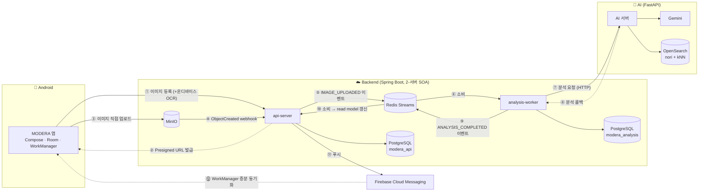

- **이벤트 기반 SOA**: api-server와 analysis-worker는 HTTP 직접 호출 없이 Redis Streams로만 통신. Consumer Group + XACK 기반 at-least-once 전달에 eventId dedup·UNIQUE 제약으로 멱등 처리
- **CQRS 성격의 read model**: 분석 결과 이벤트를 합쳐 조회 전용 스키마(`query_schema`)에 upsert — 목록·검색 조회는 원본 테이블 JOIN 없이 1회 조회로 처리
- **자연어 검색도 이벤트로**: 검색 요청 → 이벤트 발행 → worker가 AI 검색 호출 → 결과 이벤트 회신 → api-server가 대기 중인 요청에 매칭(correlationId), 10초 타임아웃

---

## 6. 주요 기능

### 6-1. 이미지 수집·업로드

- 갤러리 다중 선택 등록 + 다른 앱에서 **공유하기**로 바로 등록 (ACTION_SEND)
- 온디바이스 OCR(ML Kit 한국어) 결과를 함께 제출 — 서버 비용 없이 텍스트 확보
- Presigned URL로 MinIO에 직접 업로드 (서버 무부하), SHA-256 해시 중복 방지

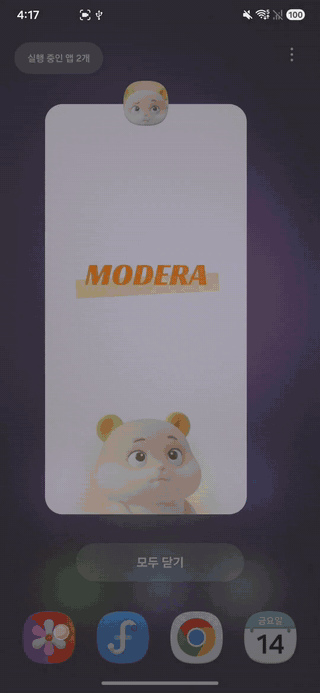

---

### 6-2. AI 자동 분석·분류

- 정보성 판정(빈 이미지 걸러내기) → 비전 분석 → 제목·요약·태그·핵심 정보(keyInformation) 생성
- 카테고리 자동 분류: 기본 13종 + AI가 새 카테고리 생성, 유사 카테고리는 자동 병합(코사인 유사도 기반)
- 카테고리 아이콘까지 AI 이미지 생성으로 자동 제작
- 분류가 마음에 안 들면 **재분석 요청** — 거부한 카테고리를 배제하고 다시 판정 (최대 5회)

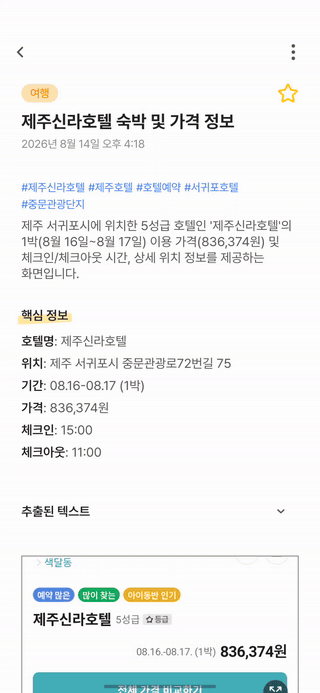

---

### 6-3. 자연어 AI 검색

- "저번에 캡처한 노트북 할인 정보" 같은 문장으로 검색
- BM25(nori 형태소 분석) + 시맨틱 kNN(bge-m3 임베딩)을 RRF로 결합한 하이브리드 검색
- 키워드 검색으로 충분하면 BM25만, 부족하면 시맨틱으로 승격하는 cascade 전략으로 정확도와 속도 모두 확보
- 최근 검색어 저장, 검색 분석 중 애니메이션

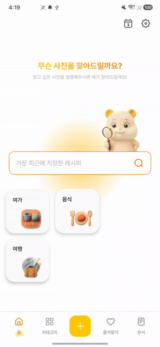

---

### 6-4. 연관 이미지

- 상세 화면에서 지금 보는 이미지와 의미적으로 가까운 이미지를 추천 (pgvector 코사인 유사도)
- 여러 장을 기준으로 한 다중 연관 검색 지원 — 문서 만들 재료를 모을 때 활용

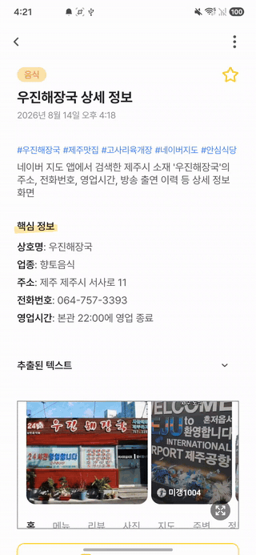

---

### 6-5. 문서 생성

- 스크린샷 여러 장을 선택하면 Gemini가 제목·요약·섹션 구조의 **마크다운 문서**로 정리
- 문서에 이미지 추가 후 재생성, 관련 자료 검색 연동
- 앱에서 마크다운 렌더링(Markwon)으로 바로 열람

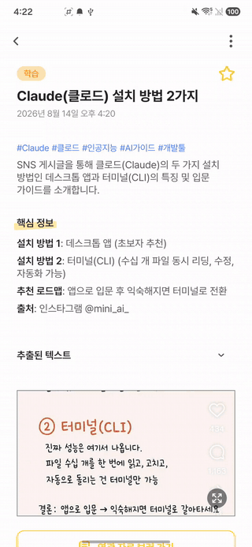

---

### 6-6. 일정 추출·캘린더

- 스크린샷 속 날짜·시간 정보를 AI가 인식해 **일정 후보**로 제안
- 확인 후 기기 캘린더에 등록/해제, 앱 내 캘린더 화면에서 모아보기

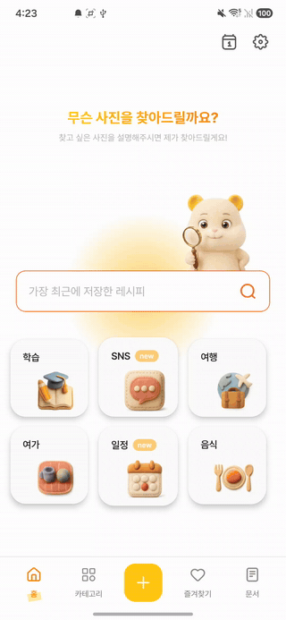

---

### 6-7. 알림·동기화

- 분석 완료·문서 생성 완료를 FCM 푸시로 알림, 알림 탭 시 해당 상세로 딥링크 이동
- 푸시를 신호로 WorkManager가 바뀐 리소스만 증분 동기화 — Room 캐시 기반 오프라인 우선 구조

<!-- TODO: FCM 알림 스크린샷 확인 — docs/404.jpg, docs/406.jpg 두 장이 현재 동일한 분석 상세 화면으로 보임. 알림(헤드업/알림창) 캡처로 교체 필요 -->
<p>

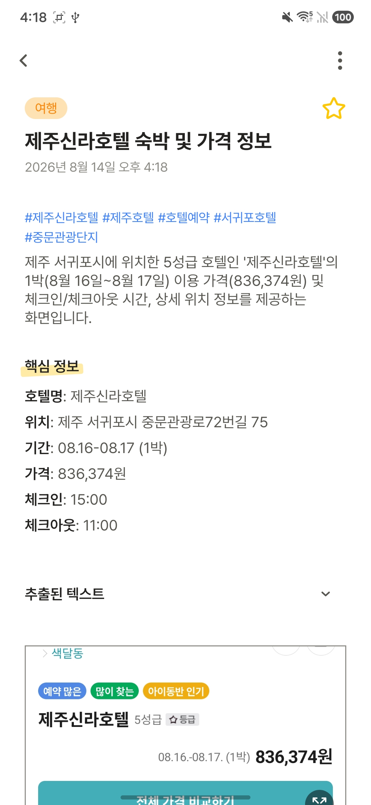
</p>

---

## 7. ERD

DB는 서버별로 분리 소유합니다 — api-server가 `modera_api`, analysis-worker가 `modera_analysis`를 단독 소유하고, 서비스 경계를 넘는 FK·JOIN 없이 논리 참조(컬럼)와 이벤트로만 결합합니다. `modera_api` 안은 다시 객체(user/image 등)·관계(`library_schema`)·조회(`query_schema`, CQRS Read Model) 스키마로 논리 분리되어 있습니다.

상세 명세: [backend/docs/database-erd.md](backend/docs/database-erd.md) · [backend/docs/analysis-db-erd.md](backend/docs/analysis-db-erd.md)

### modera_api — 객체·관계

```mermaid
erDiagram
    USERS ||--o{ USER_IMAGE : "user_id"
    IMAGE_ASSET ||--o{ USER_IMAGE : "image_id"
    IMAGE_ASSET ||--o| THUMBNAIL : ""
    IMAGE_ASSET ||--o| OCR : ""
    IMAGE_ASSET ||--o| IMAGE_CATEGORY : ""
    CATEGORY ||--o{ IMAGE_CATEGORY : ""
    IMAGE_ASSET ||--o{ IMAGE_TAG : ""
    TAG ||--o{ IMAGE_TAG : ""
    IMAGE_ASSET ||--o{ IMAGE_DOCUMENT : ""
    DOCUMENT ||--o{ IMAGE_DOCUMENT : ""
    USERS ||--o{ USER_DOCUMENT : ""
    DOCUMENT ||--|| USER_DOCUMENT : ""
    USERS ||--o{ USER_FAVORITE_IMAGE : ""
    IMAGE_ASSET ||--o{ USER_FAVORITE_IMAGE : ""
    USERS ||--o{ USER_SCHEDULE : ""
    SCHEDULE ||--|| USER_SCHEDULE : ""
    IMAGE_ASSET ||--o{ IMAGE_SCHEDULE : ""
    SCHEDULE ||--|| IMAGE_SCHEDULE : ""

    USERS {
        INTEGER user_id PK
        VARCHAR provider
        VARCHAR email UK
    }
    IMAGE_ASSET {
        INTEGER image_id PK
        CHAR content_hash UK
        VARCHAR s3_key UK
        VARCHAR upload_status
    }
    CATEGORY {
        INTEGER category_id PK
        VARCHAR name UK
        VARCHAR image_s3_key
    }
    TAG {
        INTEGER tag_id PK
        VARCHAR name UK
    }
    DOCUMENT {
        INTEGER document_id PK
        VARCHAR name
        TEXT content
    }
    SCHEDULE {
        INTEGER schedule_id PK
        VARCHAR title
        TIMESTAMPTZ start_at
        TIMESTAMPTZ end_at
    }
```

- 관계 테이블(`library_schema`)은 객체의 세부 정보를 복사하지 않고 ID 관계만 저장하며, 화면 조회는 `query_schema`의 Read Model(`user_image_view`, `user_category_view`, `user_document_view`, `document_image_view`, `user_schedule_view`)이 담당합니다.

### modera_analysis — 분석 DB (analysis-worker 단독 소유)

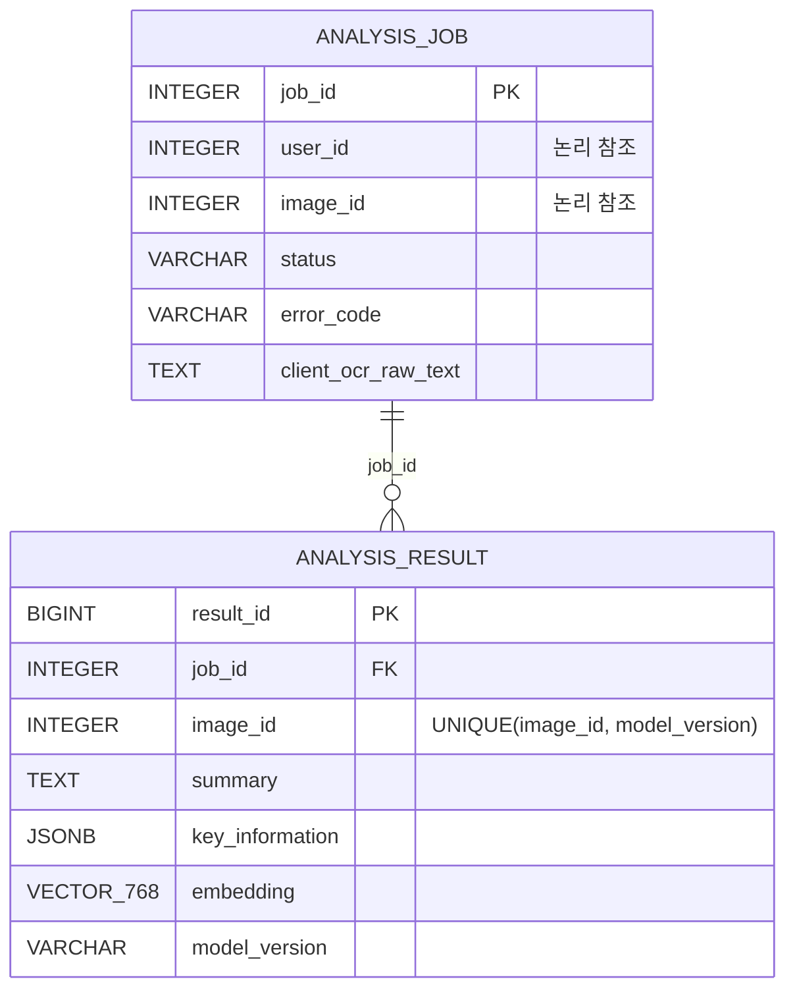

- CQRS의 write side가 이 DB, read side가 `modera_api`의 `query_schema`입니다. 분석 결과는 `ANALYSIS_COMPLETED` 이벤트를 타고 api DB의 Read Model로 넘어갑니다.
