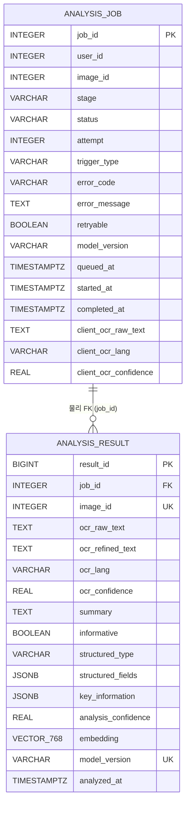
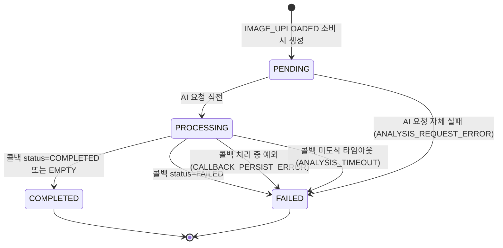
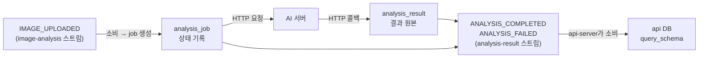

# MODERA ANALYSIS DB ERD

> 기준: `modera_analysis` 로컬 DB 및 Liquibase `400-add-stuck-job-index` 반영 구조
> 범위: analysis-worker가 단독 소유하는 분석 DB
> 제외: api-server 전용 `modera_api` DB — [database-erd.md](./database-erd.md) 참고

## 공통 설계 원칙

- `public` schema 하나만 사용한다. api DB처럼 객체·관계·조회 스키마로 나누지 않는다.
  도메인이 "분석" 하나뿐이라 도메인 간 관계가 없고, 사용자 화면을 직접 조회하는 서버가
  아니라 조회용 Read Model을 둘 대상도 없기 때문이다.
- **analysis-worker만 이 DB에 접속한다.** api-server는 `modera_analysis`에 접속하지 않는다.
- `image_id`, `user_id`는 api DB가 소유한 값의 **논리 참조**다. 서비스 경계를 넘는 물리 FK는
  만들지 않고, 존재 여부는 이벤트를 발행한 쪽이 보장한다.
- 물리 FK는 같은 DB 안의 부모-자식 관계인 `analysis_result.job_id → analysis_job`
  하나뿐이다.
- 사용자에게 보이는 분석 결과의 조회 모델은 이 DB에 없다. `ANALYSIS_COMPLETED` 이벤트를
  타고 api DB의 `query_schema.user_image_view`로 넘어간다. **CQRS의 write side가 이 DB,
  read side가 api DB**인 셈이라 여기에 조회 테이블을 또 만들면 중복이 된다.
- `vector` 확장은 DB init 스크립트(`local-infra/analysis-db/init/`)에서 만든다.
  Liquibase는 테이블·인덱스만 다룬다.

---

## 1. ERD

### 테이블 명세

| 테이블 | PK | 주요 제약 및 인덱스 | 비고 |
|---|---|---|---|
| `analysis_job` | `job_id` | `image_id`, `stage`, `status`, `attempt` NOT NULL / 부분 인덱스 `idx_analysis_job_stuck (started_at) WHERE status = 'PROCESSING'` | 분석 작업 한 건의 **상태 기록**. 이벤트 소비 시 생성되고 콜백 또는 배치가 종료 상태로 확정한다. |
| `analysis_result` | `result_id` | `UNIQUE (image_id, model_version)`, `job_id` 물리 FK | 분석 **결과 원본**. 유니크 제약이 이벤트 중복 수신 시 중복 저장을 막는다. |

### 컬럼 설계 메모

**`analysis_job`**

- `user_id` — 콜백에는 userId가 없어서, 결과 이벤트를 발행할 때 쓰려고 job 생성 시점에
  실어 둔다. 마이그레이션 `200` 이전 행은 NULL이라 이벤트 발행 전에 null 체크가 필요하다.
- `client_ocr_raw_text` / `client_ocr_lang` / `client_ocr_confidence` — 클라이언트가 업로드
  시점에 수행한 온디바이스 OCR. `IMAGE_UPLOADED`로 들어오지만 이 값을 쓰는 결과 저장은
  한참 뒤 AI 콜백에서 일어나고, AI는 refined 텍스트만 돌려주고 raw/lang/confidence는
  echo하지 않는다. 메모리나 Redis 대신 job 행에 두면 worker 재시작·다중 인스턴스에서도
  유실 창이 없다.
- `attempt` / `trigger_type` — 재분석을 염두에 둔 컬럼. 현재는 각각 `1`, `INITIAL` 고정이다.
- `retryable` — 나중에 재분석 대상을 고르기 위한 플래그. 실패 원인이 시간이 지나면 해소될
  수 있는 종류인지를 나타낸다.
- `stage` — AI 파이프라인 단계. 현재는 `FULL`(LLM → 이미지 분석 → 에이전트 전체) 하나만 쓴다.

**`analysis_result`**

- `embedding vector(768)` — pgvector 타입. `structured_fields`·`key_information`(JSONB)와
  함께 Hibernate 표준 매핑이 없어, 이 테이블은 JPA 엔티티가 아니라 `JdbcTemplate` 기반
  `AnalysisResultRepository`로 다룬다.
- `ocr_raw_text` vs `ocr_refined_text` — 전자는 클라이언트 온디바이스 OCR 원문(job에서
  옮겨온 값), 후자는 AI가 정제한 텍스트다. 출처가 다르다.
- `key_information` — 값이 없으면 빈 배열이 아니라 NULL로 둔다. "AI가 안 보냄"과 "보냈는데
  비어 있음"을 구분해야 나중에 재분석 대상을 고를 수 있다.
- `structured_type` / `structured_fields` — MVP 범위 밖이라 현재는 항상 NULL이다.

---

## 2. job 상태 전이

| 상태 | 의미 | 다음 상태를 확정하는 주체 |
|---|---|---|
| `PENDING` | job 행만 생성된 상태 | `ImageAnalysisConsumer` (즉시 `PROCESSING`으로 전환) |
| `PROCESSING` | AI에 분석을 요청하고 콜백을 기다리는 상태 | `AnalysisCallbackService` 또는 `StuckJobScanner` |
| `COMPLETED` | 결과 저장까지 끝난 상태 | 종료 상태 |
| `FAILED` | `error_code`·`error_message`·`retryable`이 채워진 상태 | 종료 상태 |

`COMPLETED`/`FAILED`는 종료 상태이며, 이후 도착한 콜백은 무시된다(AI가 최대 3회 재전송하므로
멱등 처리가 필요하다).

### error_code 목록

| `error_code` | 발생 지점 | retryable |
|---|---|---|
| `ANALYSIS_REQUEST_ERROR` | worker → AI 요청 자체가 실패 | true |
| `CALLBACK_PERSIST_ERROR` | 콜백은 도착했으나 결과 저장·이벤트 발행 중 예외 | true |
| `ANALYSIS_TIMEOUT` | 콜백이 끝내 도착하지 않아 배치가 확정 | true |
| AI가 보낸 코드 | AI 분석 자체가 실패(콜백 status=FAILED) | AI가 보낸 값 |

---

## 3. 이벤트 흐름과의 관계

이 DB에 쓰기가 일어나는 시점은 두 번뿐이다. `IMAGE_UPLOADED`를 소비해 job을 만들 때와,
AI 콜백을 받아 결과를 저장하고 job을 확정할 때다. 조회는 콜백이 들고 온 `job_id`로 찾는
단건 조회와, 배치가 후보를 훑는 조회가 전부다.

### 복구 배치

| 배치 | 대상 | 하는 일 |
|---|---|---|
| `StuckJobScanner` | `status='PROCESSING'`이고 `started_at`이 타임아웃보다 오래된 job | `ANALYSIS_TIMEOUT`으로 확정하고 `ANALYSIS_FAILED` 발행. "분석은 시작했는데 끝나지 않은 것"을 걷어낸다. |
| `PelReclaimScanner` | Redis PEL에 남은 `image-analysis` 메시지 | XCLAIM으로 회수해 재처리. 재전달 한도 초과 시 XACK하고 포기한다. "분석이 아예 시작되지 못한 것"을 되살린다. |

---

## 운영 시 주의사항

| 항목 | 비고 |
|---|---|
| 서비스 경계 FK | `image_id`·`user_id`에는 FK가 없다. 존재하지 않는 이미지를 가리키는 job이 생기지 않도록 이벤트를 발행하는 쪽이 보장한다. |
| 이벤트 중복 수신 | 두 스트림 모두 at-least-once다. 결과 저장은 `UNIQUE (image_id, model_version)` + `ON CONFLICT DO NOTHING`으로, 콜백 재전송은 종료 상태 확인으로 막는다. |
| 재분석과 유니크 제약 | 같은 `model_version`으로 재분석하면 `ON CONFLICT DO NOTHING`이 새 결과를 조용히 버린다. 재분석 기능을 붙일 때 `DO UPDATE`로 바꿀지 결정해야 한다. |
| 중복 job 가드 | "같은 이미지에 활성 job이 있으면 건너뛴다"는 규칙은 애플리케이션 조회로만 확인한다. DB 제약이 아니라서 동시 처리 시에는 뚫릴 수 있다. |
| `user_id` NULL | 마이그레이션 `200` 이전 행은 NULL이다. 이 경우 결과 이벤트를 발행하지 않는다 — 틀린 userId가 api DB의 read model을 오염시키는 것보다 발행을 생략하고 나중에 재발행하는 편이 복구 가능하다. |
| `PENDING` 정체 | job 생성 직후 worker가 죽으면 `started_at`이 NULL인 채 `PENDING`으로 남는다. `StuckJobScanner`는 `PROCESSING`만 보므로 이 경우는 잡히지 않는다. |
| 식별자 타입 | `job_id`·`image_id`는 `INTEGER`지만 `analysis_result.result_id`만 `BIGINT`다. 마이그레이션 `020`이 `job_id`만 변환했기 때문이다. |
| 타임스탬프 | 자동 갱신 트리거가 없다. `started_at`·`completed_at`은 상태를 바꾸는 로직에서 명시적으로 채운다. |
