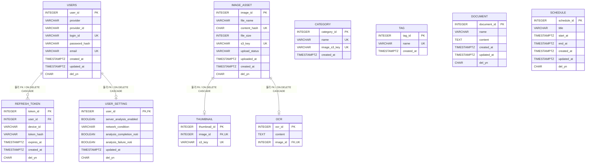
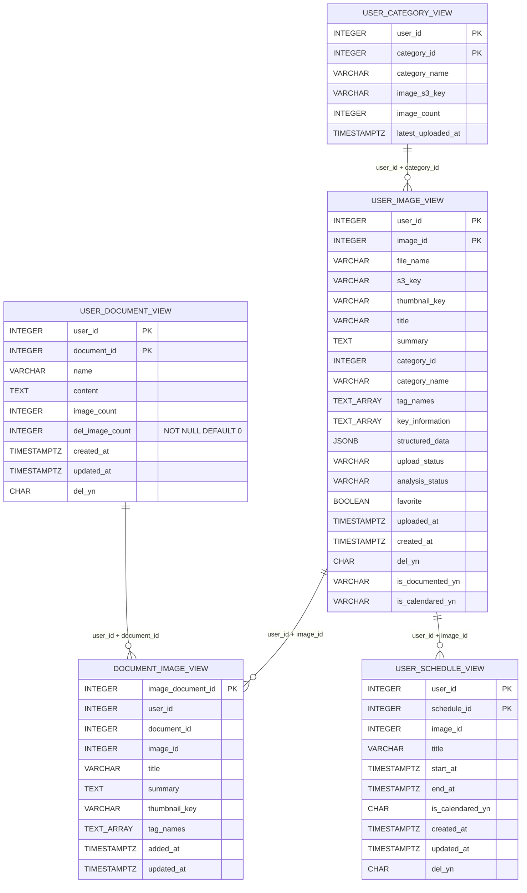
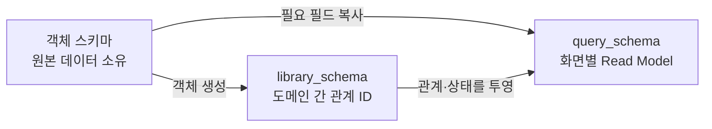

# MODERA API DB ERD

> 기준: `develop/backend` 및 Liquibase `023-add-user-image-soft-delete-and-document-deleted-count` 반영 구조
> 범위: API DB의 객체 스키마, 관계 스키마, 조회 스키마  
> 제외: `analysis-worker` 전용 `modera_analysis` DB — [analysis-db-erd.md](./analysis-db-erd.md) 참고

## 공통 설계 원칙

- 객체 데이터는 도메인별 객체 스키마가 소유한다.
- 도메인 사이의 연결은 `library_schema`가 ID만 보관하여 표현한다.
- 서비스 경계를 넘는 물리 FK는 사용하지 않는다. 해당 ID의 존재 여부와 동기화는 Spring 트랜잭션 및 이벤트 처리에서 보장한다.
- `query_schema`는 화면 조회에 필요한 데이터를 미리 합쳐 둔 CQRS Read Model이다.
- 모든 주요 식별자는 PostgreSQL `INTEGER`를 사용한다.
- `del_yn`은 `Y` 또는 `N`이며 기본값은 `N`이다.

### 최신 반영 사항

| Liquibase | 변경 사항 | 비고 |
|---|---|---|
| `020-create-schedule-domain` | `schedule`, `user_schedule`, `image_schedule`, `user_schedule_view` 추가 | 이미지 한 장에서 일정 여러 개를 추출할 수 있는 구조다. |
| `021-extend-user-image-view-for-category` | `user_image_view.category_id`, `uploaded_at` 및 카테고리별 이미지 조회 인덱스 추가 | 카테고리 화면에서 이미지 목록을 별도 JOIN 없이 조회하기 위한 Read Model 확장이다. |
| `021-create-user-category-view` | `user_category_view` 및 이름·최근 업로드·이미지 수 정렬 인덱스 추가 | 사용자별 카테고리 목록과 카테고리별 활성 이미지 수를 미리 집계한다. |
| `022-remove-ocr-lang-and-add-category-image` | `ocr.lang` 삭제, `category.image_s3_key` 및 `user_category_view.image_s3_key` 추가 | 카테고리 이미지의 MinIO/S3 객체 키를 원본과 Read Model에 저장한다. |
| `023-add-user-image-soft-delete-and-document-deleted-count` | `user_image.del_yn`, `user_document_view.del_image_count` 추가 | 사용자별 이미지 soft delete와 문서 내 삭제 이미지 수를 관리한다. |

---

## 1. 객체 스키마 ERD

객체 스키마는 각 도메인의 원본 데이터를 소유한다.

### 객체 테이블 명세

| 스키마 | 테이블 | PK | 주요 제약 및 기본값 | 비고 |
|---|---|---|---|---|
| `user_schema` | `users` | `user_id` | `provider` NOT NULL, `provider + provider_id` 부분 UNIQUE, `login_id` UNIQUE, `email` UNIQUE | 로컬 및 소셜 회원 원본. `provider_id`는 소셜 제공자 사용자 식별자다. |
| `user_schema` | `refresh_token` | `token_id` | `(user_id, device_id)` UNIQUE, `users` 물리 FK | 기기별 Refresh Token을 관리한다. 회원 물리 삭제 시 함께 삭제된다. |
| `user_schema` | `user_setting` | `user_id` | `users`와 1:0..1, 분석 및 알림 설정 기본값 제공 | 사용자별 설정 객체. `user_id`가 PK이자 FK다. |
| `image_schema` | `image_asset` | `image_id` | `content_hash` UNIQUE, `s3_key` UNIQUE, `upload_status='PENDING'` | 스토리지 이미지 원본 메타데이터. 해시 UNIQUE로 동일 파일은 전역에서 한 번만 저장한다. |
| `image_schema` | `thumbnail` | `thumbnail_id` | `image_id` UNIQUE/FK, `s3_key` UNIQUE | 이미지당 썸네일 최대 1개. 이미지 물리 삭제 시 CASCADE 삭제된다. |
| `image_schema` | `ocr` | `ocr_id` | `image_id` UNIQUE/FK | 이미지당 OCR 결과 최대 1개. 이미지 물리 삭제 시 CASCADE 삭제된다. |
| `taxonomy_schema` | `category` | `category_id` | `name` NOT NULL UNIQUE, `image_s3_key` UNIQUE | 모든 사용자가 공유하는 카테고리 사전. `image_s3_key`에는 카테고리 이미지의 MinIO/S3 객체 키를 저장한다. 생성 후 삭제하지 않는 것을 전제로 한다. |
| `taxonomy_schema` | `tag` | `tag_id` | `name` NOT NULL UNIQUE | 모든 사용자가 공유하는 태그 사전. 이미지당 최대 5개 정책은 애플리케이션에서 보장한다. |
| `document_schema` | `document` | `document_id` | `content=''`, `del_yn='N'` | Markdown 문서 원본. 이미지 관계와 소유자는 `library_schema`에서 관리한다. |
| `schedule_schema` | `schedule` | `schedule_id` | 시작·종료 nullable, 두 값이 모두 있으면 `end_at >= start_at` | 이미지 분석에서 추출한 일정 객체. 캘린더 등록 여부는 관계 테이블에서 사용자별로 관리한다. |

---

## 2. 관계 스키마 ERD

`library_schema`는 객체의 세부 정보를 복사하지 않고 객체 사이의 관계만 저장한다. 아래 객체 노드는 다른 객체 스키마에 존재하며, 연결선은 모두 논리 참조다.

```mermaid
erDiagram
    USERS ||--o{ USER_IMAGE : "user_id"
    IMAGE_ASSET ||--o{ USER_IMAGE : "image_id"

    USERS ||--o{ USER_DOCUMENT : "user_id"
    DOCUMENT ||--|| USER_DOCUMENT : "document_id"

    IMAGE_ASSET ||--o| IMAGE_CATEGORY : "image_id"
    CATEGORY ||--o{ IMAGE_CATEGORY : "category_id"

    IMAGE_ASSET ||--o{ IMAGE_TAG : "image_id"
    TAG ||--o{ IMAGE_TAG : "tag_id"

    IMAGE_ASSET ||--o{ IMAGE_DOCUMENT : "image_id"
    DOCUMENT ||--o{ IMAGE_DOCUMENT : "document_id"

    USERS ||--o{ USER_FAVORITE_IMAGE : "user_id"
    IMAGE_ASSET ||--o{ USER_FAVORITE_IMAGE : "image_id"

    USERS ||--o{ USER_SCHEDULE : "user_id"
    SCHEDULE ||--|| USER_SCHEDULE : "schedule_id"

    IMAGE_ASSET ||--o{ IMAGE_SCHEDULE : "image_id"
    SCHEDULE ||--|| IMAGE_SCHEDULE : "schedule_id"

    USERS {
        INTEGER user_id PK
    }

    IMAGE_ASSET {
        INTEGER image_id PK
    }

    CATEGORY {
        INTEGER category_id PK
    }

    TAG {
        INTEGER tag_id PK
    }

    DOCUMENT {
        INTEGER document_id PK
    }

    SCHEDULE {
        INTEGER schedule_id PK
    }

    USER_IMAGE {
        INTEGER user_image_id PK
        INTEGER user_id
        INTEGER image_id
        CHAR del_yn "NOT NULL DEFAULT N"
    }

    USER_DOCUMENT {
        INTEGER user_document_id PK
        INTEGER user_id
        INTEGER document_id
    }

    IMAGE_CATEGORY {
        INTEGER image_category_id PK
        INTEGER image_id UK
        INTEGER category_id
    }

    IMAGE_TAG {
        INTEGER image_tag_id PK
        INTEGER image_id
        INTEGER tag_id
    }

    IMAGE_DOCUMENT {
        INTEGER image_document_id PK
        INTEGER image_id
        INTEGER document_id
        TIMESTAMPTZ added_at
    }

    USER_FAVORITE_IMAGE {
        INTEGER user_favorite_image_id PK
        INTEGER user_id
        INTEGER image_id
        TIMESTAMPTZ created_at
    }

    USER_SCHEDULE {
        INTEGER user_schedule_id PK
        INTEGER user_id
        INTEGER schedule_id UK
        CHAR is_calendared_yn
        TIMESTAMPTZ created_at
        TIMESTAMPTZ updated_at
        CHAR del_yn
    }

    IMAGE_SCHEDULE {
        INTEGER image_schedule_id PK
        INTEGER image_id
        INTEGER schedule_id UK
    }
```

### 관계 테이블 명세

| 테이블 | 관계 | UNIQUE 제약 | 비고 |
|---|---|---|---|
| `user_image` | 사용자 N:M 이미지 | `(user_id, image_id)` | 하나의 이미지 원본을 여러 사용자가 공유할 수 있다. 같은 사용자의 동일 이미지 중복 등록은 불가능하다. `del_yn`은 NOT NULL, 기본값 `N`, 허용값 `Y/N`이며 사용자별 삭제 상태를 관리한다. |
| `user_document` | 사용자 1:N 문서 | `(user_id, document_id)`, `document_id` | 문서마다 소유자는 정확히 한 명이다. |
| `image_category` | 이미지 N:1 카테고리 | `image_id` | 이미지 하나에는 카테고리 최대 1개가 연결된다. |
| `image_tag` | 이미지 N:M 태그 | `(image_id, tag_id)` | 동일 이미지에 같은 태그를 중복 연결할 수 없다. 최대 5개 제한은 Spring/AI 로직에서 보장한다. |
| `image_document` | 이미지 N:M 문서 | `(document_id, image_id)` | 문서에 사용된 이미지 관계. `added_at`으로 문서에 추가된 시점을 기록한다. |
| `user_favorite_image` | 사용자 N:M 즐겨찾기 이미지 | `(user_id, image_id)` | 즐겨찾기 원본 관계. 사용자가 소유한 이미지인지 Spring에서 검증해야 한다. |
| `user_schedule` | 사용자 1:N 일정 | `(user_id, schedule_id)`, `schedule_id` | 일정 소유자는 한 명이다. `is_calendared_yn`은 사용자 캘린더 등록 여부다. |
| `image_schedule` | 이미지 1:N 일정 | `schedule_id` | 이미지 하나에서 여러 일정이 추출될 수 있지만, 일정 하나의 출처 이미지는 하나다. |

---

## 3. 조회 스키마 ERD

`query_schema`는 화면 조회에 맞춰 객체 및 관계 데이터를 비정규화한 Read Model이다. 조회 테이블끼리 물리 FK는 없으며 아래 연결도 논리적 조회 경로다.

### 조회 테이블 명세

| 테이블 | 주요 키 및 인덱스 | 주요 조회 화면 | 원본 데이터 | 비고 |
|---|---|---|---|---|
| `user_image_view` | PK `(user_id, image_id)` 부분 인덱스 `(user_id, category_id, uploaded_at DESC, image_id) WHERE del_yn='N'` | 사용자 이미지 목록 및 이미지 상세, 카테고리별 이미지 목록 | `users`, `image_asset`, `thumbnail`, taxonomy 관계, 즐겨찾기·문서·일정 관계 | 이미지 화면용 핵심 Read Model. `category_id`는 분류 식별자, `uploaded_at`은 실제 스토리지 업로드 완료 시각이다. `favorite`, `is_documented_yn`, `is_calendared_yn`은 관계 테이블에서 파생된다. |
| `user_category_view` | PK `(user_id, category_id)` 사용자별 이름·최근 업로드·이미지 수 인덱스 | 사용자별 카테고리 목록 및 정렬 | `category`, `image_category`, `user_image`, `image_asset` | 카테고리 이름, 이미지 객체 키, 활성 이미지 수, 최근 업로드 시각을 사용자별로 집계한다. `image_count`는 0 이상이어야 한다. |
| `user_document_view` | PK `(user_id, document_id)` `image_count >= 0`, `del_image_count >= 0` | 사용자 문서 목록 및 문서 상세 | `document`, `user_document`, `image_document` | 문서 원문과 포함 이미지 수를 한 번에 조회한다. `del_image_count`는 NOT NULL, 기본값 `0`이며 이미지 삭제 상태 변경 시 `image_count`와 함께 갱신해야 한다. |
| `document_image_view` | PK `image_document_id` 인덱스 `(document_id, added_at, image_document_id)` | 특정 문서에 포함된 이미지 목록 | `image_document`, `image_asset`, `thumbnail`, 분석 결과, 태그 | 문서 화면에 필요한 이미지 제목·요약·썸네일·태그를 보관한다. `added_at` 기준 정렬이 가능하다. |
| `user_schedule_view` | PK `(user_id, schedule_id)` 인덱스 `(user_id, is_calendared_yn, del_yn, start_at)` | 사용자 일정 후보 및 캘린더 일정 목록 | `schedule`, `user_schedule`, `image_schedule` | 이미지에서 추출된 일정과 캘린더 등록 상태를 함께 조회한다. 이미지 1개에 여러 행이 존재할 수 있다. |

---

## 전체 데이터 흐름

### 동기화 시 주의사항

| 항목 | 비고 |
|---|---|
| 스키마 간 FK | 의도적으로 존재하지 않는다. 객체 존재 확인과 고아 관계 방지는 Spring에서 보장한다. |
| 트랜잭션 | API DB 안에서 객체·관계·조회 모델을 함께 변경하는 작업은 하나의 트랜잭션으로 처리한다. |
| 비동기 분석 결과 | 분석 이벤트를 소비한 뒤 원본 객체/관계와 조회 모델을 멱등하게 갱신한다. |
| Read Model 재생성 | `query_schema`는 원본이 아니므로, 객체 및 관계 데이터를 기준으로 재구축할 수 있어야 한다. |
| `updated_at` | 자동 갱신 트리거가 없으므로 변경 로직에서 명시적으로 갱신한다. |
| 태그 최대 5개 | DB CHECK가 아니라 애플리케이션 및 AI 결과 검증 규칙이다. |
