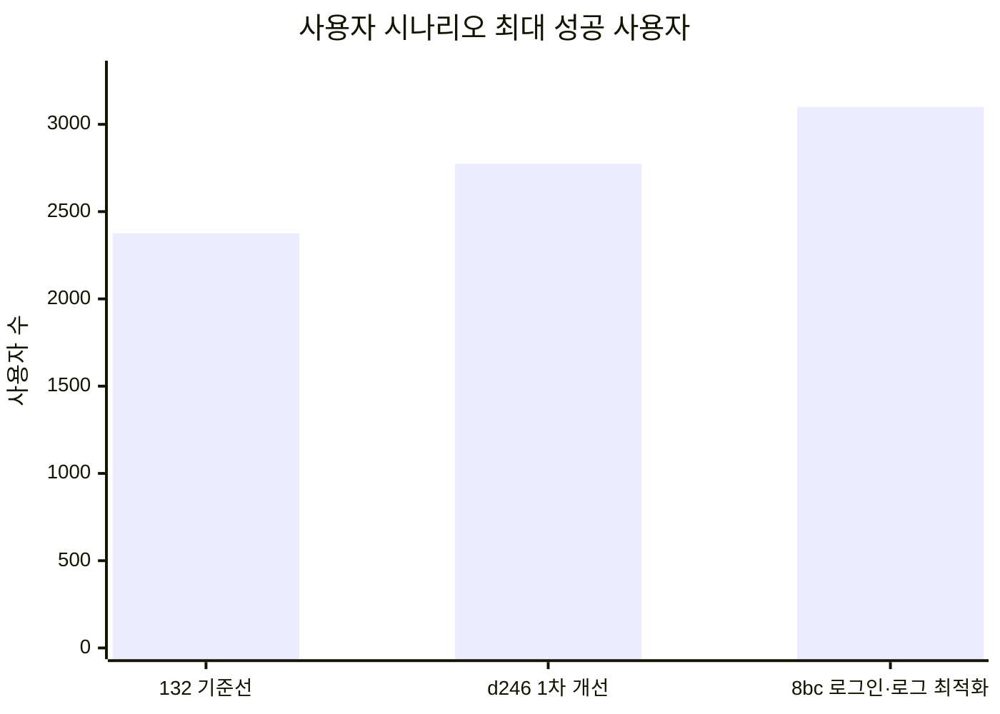

# Modera 백엔드 성능 테스트 통합 보고서

> 작성일: 2026-08-06  
> 통합 대상: `performance-test-analysis.md`, `second-api-optimization-handoff.md`  
> 대상 시스템: API Server, Analysis Worker, PostgreSQL, Redis Streams, MinIO, AI HTTP 연동  
> 목적: 초기 성능 기준선부터 2차 API·Worker 최적화 검증까지 하나의 문서에서 추적한다.

## 1. 최종 결론

1. 초기 단일 API 기준선에서 가장 큰 병목은 이미지 목록 조회였다. 사용자·카테고리·일정·문서 조회가 2,300~2,600 RPS 이상을 처리한 반면 이미지 목록은 200 RPS가 최대 통과점이었다.
2. AI를 제외한 동일 사용자 시나리오에서 최대 성공 사용자는 이전 `132` 버전 2,375명에서 1차 개선 `d246` 2,775명, 로그인 트랜잭션·로그 최적화 `8bc97270` 3,100명으로 증가했다. 이전 대비 누적 증가율은 30.53%다.
3. 실제 AI 사용자 흐름에서는 Spring API보다 AI 분석 시간이 전체 지연을 지배했다. 5명·20장 테스트의 전체 p95는 약 1분 33초였고 Worker에서 외부 AI 90초 read timeout도 확인됐다.
4. Mock AI를 사용한 전체 비동기 파이프라인은 0.3초 기준 35 jobs/s, 30초 정상 처리·생존 기준 25 jobs/s까지 통과했다.
5. 40 jobs/s부터 Worker 입력보다 API Server의 `analysis-result` 소비와 read model 반영 구간이 먼저 밀렸다.
6. 2차 최적화에서 Worker HTTP 호출을 API DB 트랜잭션 밖으로 이동한 결과, Worker 장애 중 Hikari active 최대값이 20개에서 0개로 감소했다.
7. 시맨틱 검색을 Worker 전용 스레드로 분리한 변경은 정상 부하 회귀가 없었지만, 업로드와 검색을 겹친 환경에서는 하류 API 이벤트 소비자가 먼저 포화돼 단독 효과를 측정하지 못했다.
8. 동시 업로드 중 `INITIAL_CATEGORY_RESOLVED` 중복키 예외가 3,534건 발생했고 `analysis-result` PEL과 lag가 증가했다. 현재 최우선 과제는 카테고리 초기화의 멱등성 보장과 API 결과 소비자 분리다.

## 2. 테스트 범위와 환경

### 2.1 시스템 구성

- 대상 서버: `api.example.com`
- API 컨테이너: `modera-api`
- Worker 컨테이너: `modera-worker`
- 저장소: API PostgreSQL, Worker PostgreSQL, Redis, MinIO
- 부하 도구: Grafana k6 Docker 이미지
- Docker 네트워크: `infra_default`
- 내부 API 주소: `http://modera-api:8080`
- 관측 도구: Prometheus, Grafana, Loki
- 인증: 실제 Kakao 또는 Mock Kakao 전용 사용자
- AI: 실제 AI 또는 테스트 목적의 Mock AI

k6와 대상 애플리케이션은 같은 서버에서 실행됐다. 따라서 대상 서버와 부하 발생기가 CPU, 메모리, 네트워크를 공유했다. 높은 RPS에서 발생한 `dropped_iterations`에는 서버뿐 아니라 부하 발생기 한계가 일부 포함될 수 있다.

### 2.2 테스트 범위

| 구분 | 측정 대상 |
|---|---|
| 단일 API 부하 | 사용자, 카테고리, 이미지, 일정, 문서 목록 |
| 단일 API 과부하 | 30초 비즈니스 부하와 45초 생존 요청 |
| 실제 사용자 흐름 | 로그인, 이미지 등록, MinIO 업로드, AI 분석, 목록·상세 조회 |
| 전체 비동기 파이프라인 | API → MinIO → Redis Stream → Worker → AI callback → Redis Stream → API read model |
| 2차 정상 부하 회귀 | 실데이터 기반 7개 사용자 흐름 |
| Worker 장애 격리 | Worker 60초 pause 중 API DB 커넥션 점유 |
| 업로드·검색 복합 부하 | 이미지 파이프라인 25 jobs/s와 검색 5 req/s 동시 실행 |

## 3. 판정 기준

### 3.1 단일 API 부하 테스트

- `constant-arrival-rate` 실행
- 비즈니스 요청 p95 300ms 이하
- HTTP 실패율 1% 미만
- 응답 검사 성공률 99% 이상
- `dropped_iterations = 0`

후보 RPS를 단계적으로 높이거나 이진 탐색해 모든 조건을 만족하는 최대 확인값을 기록했다.

### 3.2 단일 API 과부하 테스트

- 비즈니스 부하 30초
- 별도 생존 검사 45초, 1초마다 실행
- 생존 검사: 인증된 `GET /api/v1/categories`
- 생존 검사 성공률 100%
- 비즈니스 요청 오류와 dropped iteration 0
- 테스트 종료 후 API 및 의존 서비스 정상 상태 유지

단순히 프로세스가 종료되지 않은 상태가 아니라 목표 부하를 드롭 없이 처리하면서 별도 요청에 계속 정상 응답한 최대 RPS를 통과점으로 판정했다.

### 3.3 2차 사용자 시나리오 v2

- 사용자당 앱 API 100회
- 세션 120초
- 사용자 유입 10초 분산
- 앱 API p95 300ms 이하
- 인증 p95 1초 이하
- 시맨틱 검색 p95 1.5초 이하
- 오류 0건, 모든 사용자 100회 완주

v2에는 유사 이미지와 시맨틱 검색이 추가돼 흐름이 5개에서 7개로 늘었다. 따라서 기존 v1 사용자 수와 v2 사용자 수를 직접 비교하지 않는다.

## 4. 초기 단일 API 성능 기준선

### 4.1 0.3초 기준 최대 안정 처리량

| 기능 | API | 최대 통과 | 통과 p95 | 최초 실패 | 주요 실패 증상 |
|---|---|---:|---:|---:|---|
| 사용자 정보 | `GET /api/v1/user` | 2,300 RPS 이상 | 8.14ms | 탐색 상한 도달 | 상한 미확정 |
| 카테고리 목록 | `GET /api/v1/categories` | 2,500 RPS | 17.54ms | 2,600 RPS | dropped 60 |
| 이미지 목록 | `GET /api/v1/images?page=0&size=20` | **200 RPS** | 119.09ms | 250 RPS | p95 1.62초, dropped 781 |
| 일정 목록 | `GET /api/v1/schedules?page=0&size=20` | 2,400 RPS | 20.58ms | 2,500 RPS | dropped 11 |
| 문서 목록 | `GET /api/v1/documents?page=0&size=20` | 2,600 RPS 이상 | 28.35ms | 탐색 상한 도달 | 상한 미확정 |

`이상`은 설정한 탐색 상한까지 통과했다는 뜻이며 실제 최대 처리량이 확정됐다는 의미는 아니다.

### 4.2 이미지 목록 포화 양상

| 제안 RPS | 실제 전체 HTTP RPS | p95 | 실패율 | 드롭 | 판정 |
|---:|---:|---:|---:|---:|---|
| 100 | 98.80 | 22.79ms | 0% | 0 | 통과 |
| 150 | 148.18 | 44.88ms | 0% | 0 | 통과 |
| 200 | 197.40 | 119.09ms | 0% | 0 | 통과 |
| 250 | 215.17 | 1,621.37ms | 0.045% | 781 | 실패 |
| 500 | 213.68 | 2,164.54ms | 0.655% | 8,283 | 실패 |

200에서 250 RPS로 부하가 25% 증가할 때 p95가 약 13.6배 증가했다. 제안량을 500 RPS까지 높여도 실제 처리량은 약 214 RPS에 머물렀다.

초기 원인 후보는 다음과 같았다.

- 이미지별 태그·카테고리·문서·일정 상태 조회의 N+1 가능성
- 이미지마다 반복되는 `exists` 조회
- 엔티티 전체 조회와 DTO 변환 비용
- 긴 요약 및 전체 태그를 포함한 약 10KB 응답
- 매 요청 전체 건수 `COUNT(*)`
- JSON 직렬화와 동일 호스트 네트워크 비용
- DB 커넥션 풀 또는 Tomcat 스레드 포화

### 4.3 30초 과부하 처리 한계

| 기능 | 최대 정상 처리·생존 | 최초 실패 | 최초 실패 증상 |
|---|---:|---:|---|
| 사용자 정보 | 3,000 RPS | 3,250 RPS | dropped 311 |
| 카테고리 목록 | 2,000 RPS | 2,250 RPS | dropped 289 |
| 이미지 목록 | **200 RPS** | 300 RPS | dropped 1,884, health 96.15% |
| 일정 목록 | 2,500 RPS | 2,750 RPS | dropped 2,691 |
| 문서 목록 | 2,250 RPS | 2,500 RPS | dropped 190 |

이미지 목록은 300 RPS부터 비즈니스 요청과 생존 요청이 함께 실패했다. 다른 조회 API는 health를 유지하면서 부하 요청만 드롭했으므로 이미지 목록의 포화가 서버 전체 응답성에 가장 큰 영향을 주는 것으로 판단했다.

## 5. 실제 AI 사용자 흐름

사용자 흐름은 다음 순서로 실행했다.

1. 로그인
2. 이미지 등록과 presigned URL 발급
3. MinIO 이미지 업로드
4. 분석 완료 폴링
5. 이미지 목록 조회
6. 이미지 상세 조회

### 5.1 측정 결과

| 조건 | 전체 결과 | AI 분석 결과 | 해석 |
|---|---|---|---|
| 1명·1장 | 전체 31.19초, 성공 100% | 30.37초 | 대부분이 AI 분석 시간 |
| 2명·5장 | 평균 11.64초, p95 14.04초 | 평균 11.25초 | 소규모 동시 처리 정상 |
| 5명·20장 | 평균 22.50초, p95 약 1분 33초, 최대 약 1분 40초 | 평균 22.07초, p95 약 1분 32초 | 큰 tail latency 발생 |

5명·20장 구간에서는 외부 AI `ai.example.com`에 대한 90초 read timeout과 DNS 경고가 확인됐다. HTTP 요청 성공만으로 분석 품질까지 성공했다고 판단할 수 없으므로 `COMPLETED`, `FAILED`, `TIMED_OUT`, `EMPTY` 상태를 분리 집계해야 한다.

## 6. Mock AI 전체 백엔드 파이프라인

### 6.1 검증 경로

```text
k6 이미지 등록
  → MinIO presigned PUT
  → MinIO ObjectCreated webhook
  → API Server의 image-analysis Stream 발행
  → Analysis Worker의 Redis Stream 소비
  → Mock AI HTTP 요청
  → Mock AI의 Worker callback
  → Worker DB 결과 저장
  → analysis-result Stream 발행
  → API Server 결과 소비 및 read model 반영
  → k6 이미지 상세 조회 성공
```

Mock AI는 실제 `/internal/v1/analyze` 계약을 받고 202를 반환한 뒤 10ms 후 실제 Worker callback URL로 완료 결과를 보냈다. 외부 AI 토큰은 사용하지 않으면서 MinIO, Worker, Redis Streams, callback, 두 DB 반영을 실제 경로로 검증했다.

### 6.2 0.3초 부하 테스트

| 제안량 | 완료 건수 | 완료 처리량 | 전체 p95 | 성공률 | 드롭 | 판정 |
|---:|---:|---:|---:|---:|---:|---|
| 1 jobs/s | 30 | 0.99 jobs/s | 97.55ms | 100% | 0 | 통과 |
| 5 jobs/s | 150 | 4.94 jobs/s | 92ms | 100% | 0 | 통과 |
| 10 jobs/s | 301 | 9.89 jobs/s | 87ms | 100% | 0 | 통과 |
| 20 jobs/s | 601 | 19.74 jobs/s | 96ms | 100% | 0 | 통과 |
| 30 jobs/s | 901 | 29.56 jobs/s | 261ms | 100% | 0 | 통과 |
| 35 jobs/s | 1,051 | 34.50 jobs/s | 279.5ms | 100% | 0 | **최대 통과** |
| 40 jobs/s | 94 | 2.27 jobs/s | 11.23초 | 10.29% | 288 | 실패 |
| 50 jobs/s | 32 | 0.78 jobs/s | 11.15초 | 2.83% | 373 | 실패 |

0.3초 기준 최대 확인 처리량은 **35 jobs/s**다. 35에서 40 jobs/s 사이에서 급격한 포화 절벽이 발생했다.

40 jobs/s 직후 상태는 다음과 같았다.

- `image-analysis`: pending 0, lag 0
- `analysis-result`: pending 9, lag 12
- 약 20초 후 `analysis-result`: pending 0, lag 0

Worker 입력 소비보다 API Server의 결과 이벤트 소비와 read model 반영 구간이 먼저 밀린 것으로 해석했다.

### 6.3 30초 과부하 테스트

| 제안량 | 완료 건수 | 전체 p95 | 성공률 | health | 드롭 | 판정 |
|---:|---:|---:|---:|---:|---:|---|
| 20 jobs/s | 601 | 148ms | 100% | 45/45 | 0 | 통과 |
| 25 jobs/s | 750 | 270.54ms | 100% | 45/45 | 0 | **최대 통과** |
| 26 jobs/s | 299 | 10.84초 | 47.61% | 45/45 | 153 | 실패 |
| 27 jobs/s | 807 | 1.99초 | 100% | 45/45 | 3 | 실패 |
| 30 jobs/s | 348 | 10.70초 | 48.06% | 45/45 | 177 | 실패 |
| 35 jobs/s | 77 | 11.22초 | 9.61% | 43/43 | 249 | 실패 |

30초 동안 서버가 생존하면서 모든 파이프라인 요청을 드롭 없이 끝까지 처리한 최대 확인값은 **25 jobs/s**다. 서버 프로세스는 더 높은 단계에서도 살아 있었지만 26 jobs/s부터 완료율 또는 드롭 조건을 만족하지 못했다.

## 7. Mock Kakao 사용자 시나리오 용량 개선

### 7.1 비교 조건

세 버전은 AI·Worker·MinIO를 제외한 같은 Spring 사용자 시나리오로 측정했다.

- VU마다 서로 다른 기존 Mock Kakao 회원 사용
- 사용자당 카카오 로그인 1회
- 로그인 후 120초 동안 앱 API 정확히 100회 호출
- 홈, 갤러리, 검색, 일정, 문서의 5개 흐름을 균등 배정
- 전체 사용자를 테스트 시작 후 10초 동안 분산 진입
- 호출 간격에 ±30% jitter 적용
- 앱 p95 300ms 이하, 인증 p95 1초 이하
- 앱·인증 오류, 실패 흐름 또는 미완주 사용자가 한 명이라도 있으면 실패
- AI 분석, 실제 시맨틱 검색과 이미지 업로드 제외
- 성공·실패 경계를 25명 단위까지 이진 탐색

사용자별 앱 호출 간격은 평균 1.2초다. 로그인 요청은 모두 첫 10초 안에 시작되고 성공한 사용자는 로그인 timeout 10초 안에 앱 호출을 시작한다. 첫 사용자의 100번째 요청은 앱 진입 약 119초 후 실행되므로, 통과 테스트에서는 마지막 사용자까지 진입한 상태로 약 100초 동안 대부분의 사용자 세션이 겹친다.

### 7.2 단계별 적용 내용

| 단계 | 버전 | 주요 적용 내용 | Hikari max |
|---|---|---|---:|
| 기준선 | `modera-api:132` | 개선 전 API와 로그인 경로 | 20 |
| 1차 개선 | `d246` | API Hikari 20 → 30, 당시 API·로그인 경로 개선 묶음 | 30 |
| 로그인·로그 최적화 | `8bc97270` | Kakao 외부 확인과 DB 트랜잭션 분리, Refresh Token 해시 공통화, 정상 요청 로그 축소 | 30 |

`132 → d246` 비교에는 Hikari와 여러 API·로그인 변경이 함께 포함돼 있다. 따라서 400명 증가를 특정 변경 하나의 단독 효과로 해석하지 않는다.

`d246 → 8bc97270`에 적용한 핵심은 다음과 같다.

- Kakao 외부 HTTP 사용자 검증을 DB 트랜잭션 진입 전에 수행
- 사용자 조회·생성, 이메일 동기화, Refresh Token 갱신만 `KakaoUserTransactionService`의 짧은 트랜잭션에서 처리
- Refresh Token 저장 해시를 공통 SHA-256 경로로 통합
- 정상 로그인 성공 로그와 정상 액세스 로그를 DEBUG로 조정
- 4xx 또는 300ms 이상 요청은 WARN, 5xx는 ERROR로 유지
- Actuator 요청은 액세스 로그에서 제외
- 계정 bootstrap 후 Hikari active·pending과 timeout 누계가 회복된 뒤 본 테스트 시작

### 7.3 단계별 최대 사용자 결과



| 버전 | 최대 성공 | 최초 실패 | 최대 성공 앱 요청 | 최대 성공 전체 RPS | 앱 p95 | 인증 p95 |
|---|---:|---:|---:|---:|---:|---:|
| 이전 `132` | **2,375명** | 2,400명 | 237,500 | 1,706.63 req/s | 50.01ms | 213.82ms |
| 1차 개선 `d246` | **2,775명** | 2,800명 | 277,500 | 1,988.62 req/s | 246.31ms | 635.08ms |
| 로그인·로그 최적화 `8bc97270` | **3,100명** | 3,125명 | 310,000 | 2,229.06 req/s | 142.61ms | 374.30ms |

| 비교 단계 | 사용자 증가 | 최대 성공 처리율 증가 |
|---|---:|---:|
| `132 → d246` | +400명, **+16.84%** | +282.00 req/s, +16.52% |
| `d246 → 8bc97270` | +325명, **+11.71%** | +240.44 req/s, +12.09% |
| `132 → 8bc97270` | **+725명, +30.53%** | **+522.43 req/s, +30.61%** |

서로 다른 최대 부하 지점의 p95는 속도 개선값으로 직접 비교하지 않는다. 동일 부하인 2,775명에서는 다음처럼 개선됐다.

| 지표 | `d246` | `8bc97270` | 변화 |
|---|---:|---:|---:|
| 앱 p95 | 246.31ms | 31.76ms | **-87.11%** |
| 인증 p95 | 635.08ms | 381.99ms | **-39.85%** |
| 앱 요청 오류 | 0 | 0 | 동일 |
| 인증 오류 | 0 | 0 | 동일 |
| 완주 사용자 | 2,775 | 2,775 | 동일 |

### 7.4 최종 탐색 결과

| 사용자 | 앱 요청 | 앱 오류 | 인증 오류 | 완주 | 앱 p95 | 인증 p95 | 전체 RPS | 판정 |
|---:|---:|---:|---:|---:|---:|---:|---:|---|
| 2,775 | 277,500 | 0 | 0 | 2,775 | 31.76ms | 381.99ms | 1,990.83 | 통과 |
| 3,000 | 300,000 | 0 | 0 | 3,000 | 83.72ms | 496.53ms | 2,152.71 | 통과 |
| 3,050 | 305,000 | 0 | 0 | 3,050 | 144.60ms | 213.24ms | 2,189.30 | 통과 |
| 3,075 | 307,500 | 0 | 0 | 3,075 | 86.91ms | 103.05ms | 2,215.95 | 통과 |
| 3,100 | 310,000 | 0 | 0 | 3,100 | 142.61ms | 374.30ms | 2,229.06 | **최대 통과** |
| 3,125 | 286,400/312,500 | 19,333 | 261 | 2,864 | 3,220.91ms | 4,264.31ms | 1,760.55 | 최초 실패 |
| 3,250 | 324,800/325,000 | 34,573 | 2 | 3,248 | 3,449.11ms | 712.65ms | 1,795.48 | 실패 |

3,125명 실행 50초 시점에 `Hikari active=30/30`, `pending=2,783`이 관측됐다. 이후 DB 연결 획득 3초 timeout으로 로그인과 일반 앱 API가 함께 실패했다. 최초 실패 원인은 CPU·메모리 고갈보다 API Hikari 풀 포화와 DB 연결 대기 큐 급증이었다.

bootstrap 직후 Hikari가 회복되지 않은 상태에서 실행한 최초 2,775명 결과는 제외했다. 계정 준비와 본 측정 사이에 다음 조건을 확인한 뒤 재실행한 결과만 유효값으로 사용했다.

```text
Hikari active = 0
Hikari pending = 0
Hikari timeout 누계 증가 없음
```

### 7.5 해석

- 최대 성공 사용자는 같은 조건의 단일 실행에서 2,375 → 2,775 → 3,100명으로 증가했다.
- 최종 버전은 3,100명의 서로 다른 사용자가 총 310,000개의 앱 API를 오류 없이 완료했다.
- 10초 분산 진입과 120초 세션 때문에 대부분의 사용자 세션이 약 100초 동안 실제로 겹쳤다.
- 3,100명은 영구 보장 용량이 아니라 이 테스트 환경에서 확인한 최대 성공값이다.
- Hikari 최대값 30을 유지한다면 다음 개선 수단은 로그인 트랜잭션 내부 연결 점유시간 축소, DB 쿼리·인덱스 최적화와 클라이언트 로그인 jitter다.

## 8. 2차 API·Worker 최적화

### 8.1 개선 목표

| 대상 | 개선 전 구조적 위험 | 개선 목표 |
|---|---|---|
| A. 유사 이미지 API | Worker HTTP 호출을 DB `@Transactional` 안에서 실행해 Worker 지연이 API Hikari 점유로 전파 | 외부 HTTP 대기를 트랜잭션 밖으로 이동 |
| B. 시맨틱 검색 Worker 소비 | 이미지 분석과 검색이 같은 단일 소비자 스레드를 공유 | 사용자 대기 검색 이벤트를 전용 스레드로 분리 |

### 8.2 A: `ImageSimilarService` 트랜잭션 경계 분리

- `ImageSimilarService` 클래스의 `@Transactional(readOnly = true)` 제거
- Worker HTTP 호출과 응답 조립을 트랜잭션 밖에서 실행
- DB 조회를 `ImageSimilarReader`의 짧은 읽기 트랜잭션으로 이동
- 소유권·제목, 결과 재검증 요약, 문서화 기준 검증을 독립된 짧은 DB 구간으로 분리
- 응답 구조, 오류 코드, 검증 순서는 유지
- `ImageSimilarTransactionBoundaryTest`로 경계 고정

### 8.3 B: `ImageAnalysisConsumer` 검색 전용 스레드 분리

- `IMAGE_SEMANTIC_SEARCH_REQUESTED`만 `semantic-search-consumer` 전용 단일 스레드에서 처리
- 이미지 분석 이벤트는 기존 메인 루프 유지
- payload 파싱 실패 정책 유지
- 처리 완료 후에만 XACK하는 at-least-once 의미 유지
- 종료 시 미완료 검색은 XACK하지 않고 PEL 회수 대상으로 유지
- 이벤트 계약, Stream 이름, API Server 코드는 변경하지 않음

### 8.4 기능 검증

- `:api-server:test` 전체 통과
- `:analysis-worker:test` 전체 통과
- 트랜잭션 경계, 검색 라우팅, 전용 스레드, XACK 보류 테스트 포함
- 로컬 E2E 24/24 통과
- 이미지 파이프라인, 유사 이미지, 시맨틱 검색, 문서 흐름 정상 확인

## 9. 2차 테스트 데이터와 시나리오

### 9.1 실데이터 시딩

| 항목 | 결과 |
|---|---:|
| 사용자 | Mock Kakao 200명 |
| 등록 이미지 | 37,000건 |
| 사용자별 분포 | 50장 50%, 200장 30%, 500장 20% |
| 즐겨찾기 | 3,700건, 전체의 10% |
| 카테고리 | 7종 |
| 사용자 완주 | 200/200 |
| 시딩 시간 | 26분 28초 |
| 실측 처리량 | 23.3 jobs/s |
| 등록 API p95 | 11.8ms |
| Worker PEL | 0 |

동일 DB 데이터를 개선 전후 컨테이너가 공유하도록 구성해 데이터 조건을 통제했다. 시딩 데이터는 카테고리 필터, 일정, keyword 검색, 시맨틱 검색, 유사 이미지와 문서 흐름을 모두 실제 read model로 실행할 수 있도록 만들었다.

### 9.2 시나리오 v2 구성

기존 5개 흐름에 다음 2개를 추가했다.

- `06_detail_similar`: 이미지 목록 → 상세 → 유사 이미지 조회
- `07_semantic`: 키워드 5종을 순환하는 시맨틱 검색

검색은 Redis Stream 왕복과 최대 10초 서버 대기를 포함하므로 일반 앱 API와 분리해 `kind=search`로 측정했다.

## 10. 2차 실험 결과

### 10.1 E1: 정상 부하 용량과 회귀 확인

동시 사용자 125 → 150 → 175 → 200명, 사용자당 API 100회, 세션 120초, 유입 10초 분산 조건으로 실행했다.

| 사용자 | 앱 p95 개선 전 135 | 앱 p95 개선 후 139 | 검색 p95 개선 전 | 검색 p95 개선 후 | 오류 | 완주 |
|---:|---:|---:|---:|---:|---:|---:|
| 125 | 22.67ms | 21.98ms | 116ms | 115ms | 0 | 125/125 |
| 150 | 10.93ms | 11.31ms | 112ms | 111ms | 0 | 150/150 |
| 175 | 16.61ms | 13.76ms | 116ms | 139ms | 0 | 175/175 |
| 200 | 9.16ms | 11.84ms | 124ms | 121ms | 0 | 200/200 |

판정은 **정상 부하 회귀 없음**이다. 두 버전 모두 200명까지 오류 없이 전원 완주했다. 개선 전후 차이는 실행 변동 범위이며 특정 버전이 더 빠르다고 단정할 수 없다.

시딩 사용자가 정확히 200명이어서 최대 사용자 경계는 찾지 않았다. 정확한 결론은 “실데이터 사용자 200명까지 여유 있게 통과했으며 한계는 미확인”이다.

### 10.2 E2: Worker 장애 중 DB 트랜잭션 격리

200 VU 부하 중 Worker 컨테이너를 60초 pause해 TCP 연결이 3초 read timeout을 모두 소비하도록 만들었다.

| 지표 | 개선 전 135 | 개선 후 137·139 | 변화 |
|---|---:|---:|---:|
| **Hikari active 최대** | **20** | **0** | **-100%** |
| Hikari pending 최대 | 0 | 0 | 동일 |
| 커넥션 획득 실패 | 0 | 0 | 동일 |
| 유사 이미지 p95 | 3,125ms | 3,051ms | 기능상 동일 timeout |
| 일반 조회 p95 | 3.13ms | 3.00ms | 영향 없음 |

개선 전에는 Worker가 응답하지 않는 동안 풀 30개 중 최대 20개를 점유했지만 개선 후에는 0개였다. 사용자에게 보이는 유사 이미지 API는 양쪽 모두 약 3초 후 빈 목록으로 degrade했지만, 개선 후에는 기다리는 동안 DB 커넥션을 점유하지 않았다.

`pending=0`이라고 위험이 없었던 것은 아니다. 유사 이미지 요구량은 약 7.8 req/s × 3초로 동시 약 23개였다. API Hikari가 1차 개선 전 크기인 20개였다면 고갈될 수 있는 수준이다.

### 10.3 E3: 이미지 업로드와 시맨틱 검색 동시 실행

파이프라인 업로드 25 jobs/s와 시맨틱 검색 5 req/s를 90초 동안 동시에 실행했다.

| 버전 | 검색 p95 | 504 오류 | 검색 checks | 파이프라인 성공률 |
|---|---:|---:|---:|---:|
| 개선 후 139 | 10,044ms | 420 | 0% | 0.22%, 7/3,153 |
| 개선 전 135 | 10,044ms | 420 | 0% | 0.18%, 6/3,173 |

두 버전이 사실상 동일하게 실패했다. 이는 Worker 검색 전용 스레드보다 하류에 공통 병목이 존재한다는 뜻이다.

#### 원인 증거

| 증거 | 측정값 |
|---|---:|
| `analysis-result` PEL 증가 | +1,697건, 36,219 → 37,916 |
| `uq_taxonomy_category_name` 중복키 오류 | 3,534건 |
| 소비자 lag 누적 | 2,385건 |
| 업로드 없는 E1 검색 p95 | 115ms |

업로드마다 발생한 `INITIAL_CATEGORY_RESOLVED`가 이미 존재하는 7개 카테고리를 다시 생성하려다 중복키 예외를 발생시켰다. 예외 처리와 스택트레이스 기록이 단일 API `analysis-result` 소비자를 포화시켰고, 같은 소비자를 기다리는 `IMAGE_SEARCH_COMPLETED`가 10초 상한을 넘겼다.

초기에는 시딩 직후 남은 과거 backlog를 의심했지만, 1.5시간 유휴 후 lag 0 상태에서도 동일하게 재현됐다. 따라서 원인은 과거 backlog가 아니라 동시 업로드가 실시간으로 만드는 API 이벤트 소비 병목으로 정정했다.

## 11. 통합 병목 분석과 개선 우선순위

### 11.1 1순위: 카테고리 초기화 멱등성

현재 Redis Streams는 at-least-once이므로 동일 이벤트와 동일 카테고리 생성을 정상 상황으로 처리해야 한다.

권장 방향:

- 카테고리 이름 UNIQUE 유지
- `INSERT ... ON CONFLICT DO NOTHING`
- 충돌 후 기존 카테고리 재조회
- 이미 존재하는 카테고리를 정상 성공으로 처리하고 XACK
- 예상 가능한 중복에 전체 예외 스택트레이스를 남기지 않음

### 11.2 2순위: API `analysis-result` 소비자 분리

- 사용자 대기 이벤트인 `IMAGE_SEARCH_COMPLETED`를 대량 분석 결과와 분리
- 전용 consumer group, 소비 스레드 또는 executor 검토
- 카테고리·분석 read model 반영이 밀려도 검색 응답이 head-of-line blocking을 받지 않도록 구성
- PEL, lag, 이벤트 처리시간을 이벤트 타입별로 수집

### 11.3 3순위: 이미지 목록 조회

- 요청당 SQL 수와 N+1 확인
- 반복 `exists` 쿼리를 일괄 조회로 통합
- 목록 전용 Projection 사용
- `EXPLAIN (ANALYZE, BUFFERS)`로 정렬과 count 비용 확인
- 사용자·카테고리·업로드 시각·ID에 맞는 복합 인덱스 검토
- 응답에 필요하지 않은 긴 summary와 태그 축소 검토
- Hikari acquire time, Tomcat active thread, 직렬화 CPU를 같은 구간에서 대조

### 11.4 4순위: AI와 Worker 회복성

- connect timeout과 read timeout 분리
- 제한 횟수의 지수 백오프 재시도
- Circuit Breaker와 bulkhead 적용
- Worker 동시 처리량 제한과 backpressure
- 분석 실패·timeout·빈 결과 상태 분리
- callback 저장 실패 재처리 또는 DLQ 구성

### 11.5 재검증 순서

1. 카테고리 초기화를 멱등하게 변경
2. E3 업로드 25 jobs/s × 검색 5 req/s 재실행
3. `analysis-result` PEL, lag, 검색 p95와 504 확인
4. API 검색 소비자 분리 적용
5. 동일 E3 재실행으로 Worker 검색 전용 스레드 효과 분리
6. 이미지 목록 쿼리·인덱스 개선 후 200 RPS 기준선을 동일 데이터에서 재측정

## 12. 테스트 중 제외한 무효 결과

| 실행 | 제외 이유 |
|---|---|
| 카테고리 `sort=name,asc` 초기 실행 | 배포 API가 지원하지 않는 파라미터로 400 반환 |
| k6 summary 디렉터리 권한 오류 | 결과 JSON 생성 실패 |
| 최초 과부하 health 실행 | 인증되지 않은 Actuator를 대기 없이 반복 호출 |
| 최초 E2 대조군 | 8080에서 Actuator를 폴링해 Spring 부팅 전 테스트 시작 |

Actuator 관리 포트는 9080이다. 이후 `http://modera-api:9080/actuator/health`가 정상 응답한 뒤 k6를 시작하도록 수정했다.

## 13. 결과 해석의 제한사항

- k6와 대상 서버가 동일 호스트에서 실행됐다.
- 대부분 후보를 1회 측정했으며 3회 반복 중앙값이 아니다.
- 일부 후보는 연속 실행돼 DB cache, JVM warm-up, 이전 부하의 영향을 받을 수 있다.
- API별 데이터 크기가 실제 운영 분포와 다를 수 있다.
- E1은 시딩 사용자 200명이 상한이어서 최대 사용자 경계를 찾지 않았다.
- v1과 v2는 흐름 수와 API 조합이 달라 절대 사용자 수를 직접 비교하지 않는다.
- E3는 카테고리 멱등성과 API 소비자 병목을 먼저 제거해야 Worker 검색 스레드 분리 효과를 측정할 수 있다.
- Mock AI 결과는 Spring·MinIO·Redis·Worker 파이프라인 한계이며 실제 AI 연산 용량을 의미하지 않는다.
- cAdvisor가 없어 컨테이너별 CPU와 메모리를 완전히 분리하지 못했다.

최종 용량을 확정하려면 별도 부하 발생기, 고정 DB snapshot, 후보별 충분한 회복 시간과 3회 이상 반복 측정을 적용해야 한다.

## 14. 테스트 후 상태와 데이터

- API Server와 Worker Server는 고부하 중 종료되지 않았다.
- 전체 파이프라인 테스트 종료 전 Redis Stream pending과 lag가 0으로 회복됐다.
- Mock AI 테스트 후 Worker를 실제 AI 주소로 복구했다.
- Mock Kakao 테스트 후 실제 Kakao 설정으로 복구했다.
- 시딩과 성능 테스트가 생성한 이미지·분석 데이터는 자동 삭제하지 않았다.
- 테스트 데이터는 전용 계정 구간으로 식별할 수 있지만 삭제는 별도 검증과 승인 후 진행해야 한다.

## 15. 재현 스크립트와 결과 위치

### 15.1 주요 스크립트

| 파일 | 역할 |
|---|---|
| `ops/k6/endpoint-load.js` | 단일 API 부하 테스트 |
| `ops/k6/endpoint-overload.js` | 단일 API 과부하와 생존 검사 |
| `ops/k6/find-max-remote.sh` | RPS 경계 탐색 |
| `ops/k6/user-flow.js` | 실제 이미지 업로드·분석 사용자 흐름 |
| `ops/k6/pipeline-load.js` | Mock AI 전체 파이프라인 부하 |
| `ops/k6/pipeline-overload.js` | Mock AI 전체 파이프라인 과부하 |
| `ops/k6/kakao-user-seed.js` | 실데이터 사용자 시딩 |
| `ops/k6/kakao-user-capacity.js` | 7개 흐름 사용자 용량 테스트 |
| `ops/k6/semantic-search-load.js` | 시맨틱 검색 부하 |
| `ops/k6/run-worker-outage-drill.sh` | Worker 장애 격리 실험 |
| `ops/k6/run-search-under-pipeline.sh` | 업로드·검색 복합 부하 |
| `ops/mock-ai/server.py` | 토큰을 사용하지 않는 AI Stub과 callback |
| `ops/grafana/deploy-performance-dashboard.sh` | Grafana 성능 대시보드 배포 |

### 15.2 서버 결과 디렉터리

```text
/home/ubuntu/k6/results/seed-2nd-20260804
/home/ubuntu/k6/results/e1-after-139
/home/ubuntu/k6/results/e1-before-135
/home/ubuntu/k6/results/e2-after-137
/home/ubuntu/k6/results/e2-before-135
/home/ubuntu/k6/results/e3-after-139
/home/ubuntu/k6/results/e3-before-135
```

### 15.3 사용자 용량 원시 결과

- `docs/performance-results/kakao-capacity-previous-132-20260804.tsv`
- `docs/performance-results/kakao-capacity-current-d246-20260804.tsv`
- `docs/performance-results/kakao-capacity-current-8bc97270-20260804.tsv`

### 15.4 원본 문서

- [전체 성능 테스트 분석](./performance-test-analysis.md)
- [Mock Kakao 사용자 용량 및 로그인 최적화](./kakao-dummy-user-progressive-test-handoff.md)
- [2차 API·Worker 최적화 인수인계](./second-api-optimization-handoff.md)

이 통합본은 세 원본의 핵심 조건, 수치, 판정과 후속 과제를 재구성한 문서다. 세부 실행 시각, epoch와 개별 명령은 원본 인수인계 문서를 함께 참조한다.
