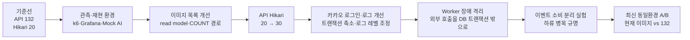
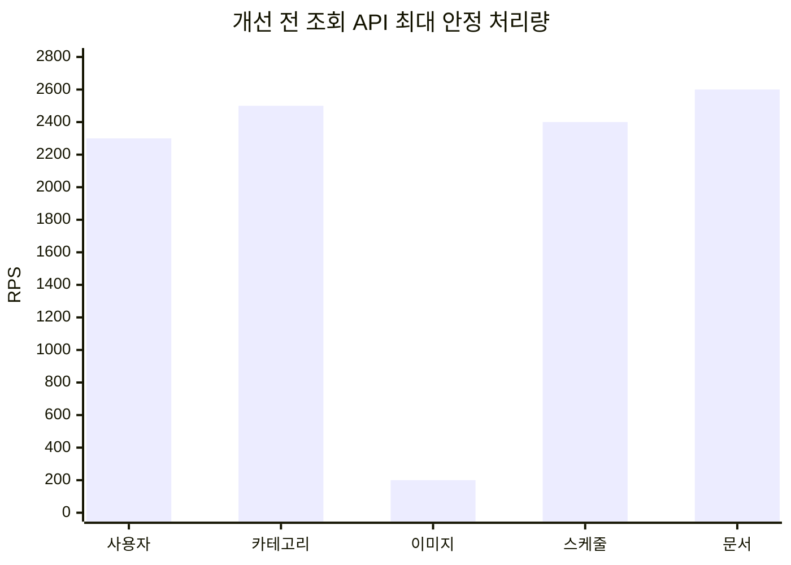
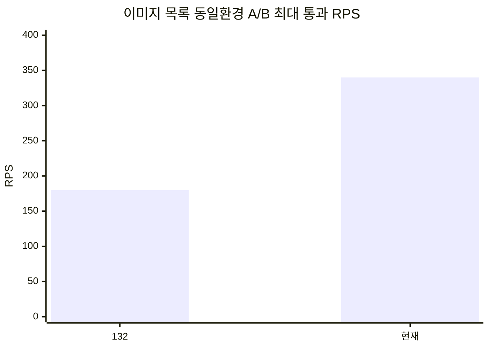
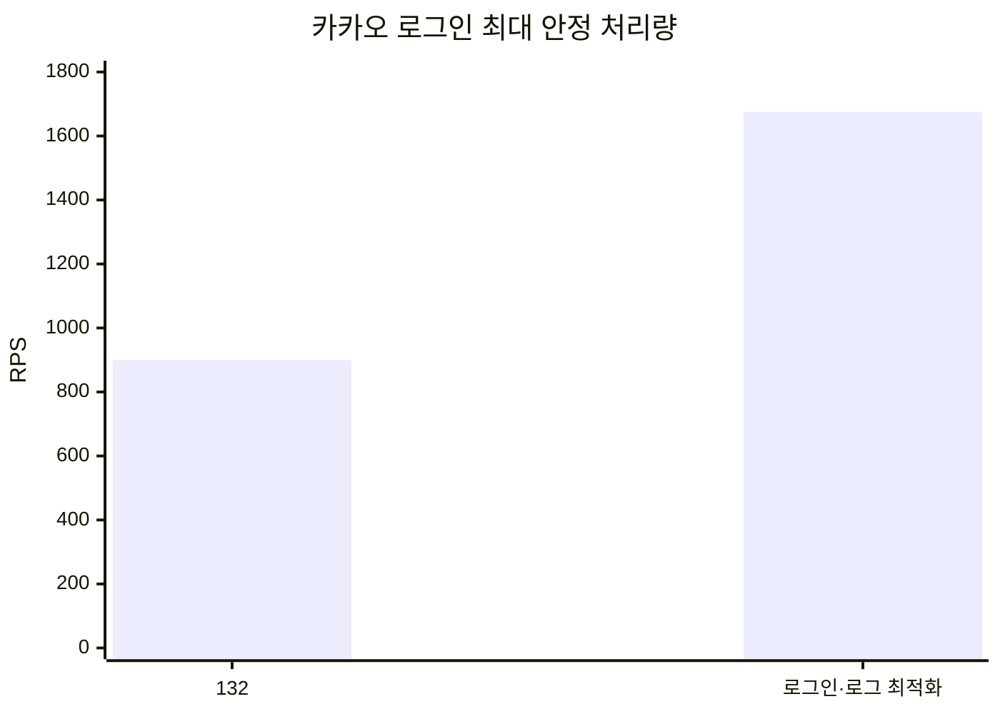
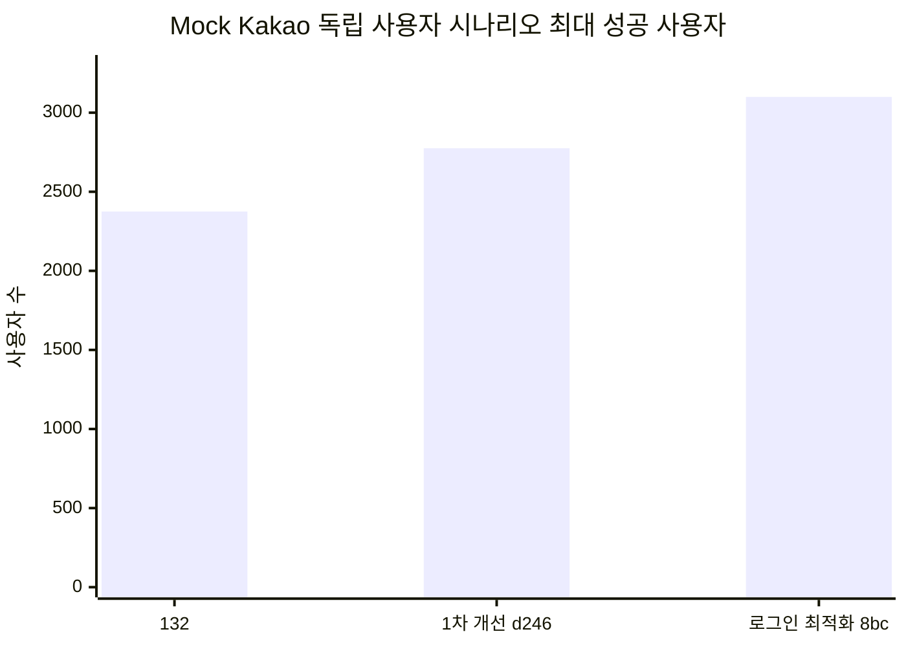
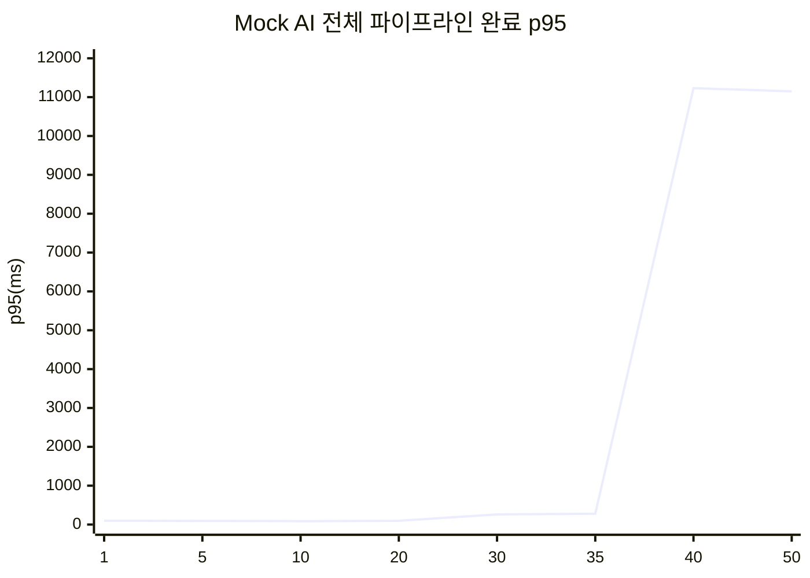
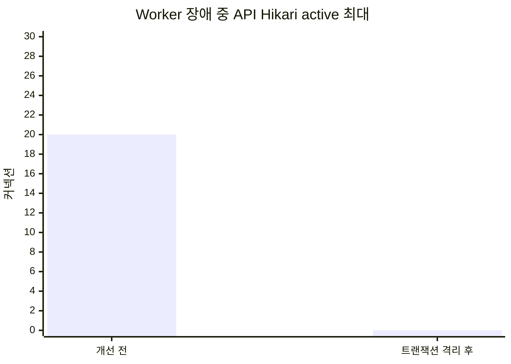

# Modera 백엔드 성능 테스트 통합 보고서

> 정리 범위: 2026-08-03 ~ 2026-08-05 수행 결과  
> 대상: API Server, PostgreSQL, Redis, MinIO, Analysis Worker, 이벤트 버스, Mock/실제 AI  
> 목적: 개선 전 기준선부터 최신 버전까지 적용 사항, 성능 변화, 병목과 남은 과제를 한 문서에서 추적한다.

## 1. 최종 결론

- 개선 전 단일 API에서 가장 큰 병목은 이미지 목록이었다. 다른 조회 API가 2,300~2,600 RPS 이상을 처리할 때 이미지 목록은 200 RPS에서 포화됐다.
- 이미지 목록 쿼리와 `totalElements` 경로를 개선한 뒤, 2026-08-05 동일 환경 A/B에서 `modera-api:132`의 180 RPS가 최신 버전 340 RPS로 증가했다. 증가량은 160 RPS, 약 88.9%다.
- 카카오 로그인 최대 안정 처리량은 동일한 60초 기준에서 132 버전 900 RPS에서 개선 버전 1,675 RPS로 증가했다. 증가량은 775 RPS, 약 86.1%다.
- Mock Kakao 독립 사용자 시나리오의 최대 성공 사용자는 132 버전 2,375명, 1차 개선 버전 2,775명, 로그인 트랜잭션·로그 최적화 버전 3,100명으로 증가했다.
- 사용자 시나리오 최초 실패의 직접 원인은 CPU·메모리 고갈보다 API Hikari 풀 포화였다. 3,125명에서 `active=30`, `pending=2,783`과 DB 연결 획득 timeout이 확인됐다.
- Mock AI 전체 파이프라인은 0.3초 기준 35 jobs/s, 30초 정상 처리·생존 기준 25 jobs/s까지 통과했다. 병목은 Worker 입력보다 `analysis-result` 소비와 API read model 반영 구간이었다.
- Worker 장애 격리 개선 후 Worker HTTP timeout 중 Hikari active 최대값이 20개에서 0개로 감소했다.
- 업로드와 시맨틱 검색을 겹친 테스트는 개선 전후 모두 검색 p95 약 10초로 실패했다. `INITIAL_CATEGORY_RESOLVED` 중복키 예외와 API의 단일 `analysis-result` 소비자가 남은 병목이다.
- 최신 이미지 목록에는 아직 정렬 인덱스 불일치가 남아 있다. 현재 쿼리는 11,047개를 읽고 정렬해 20개를 반환하며 22.913ms가 걸렸지만, 인덱스 순서와 맞춘 대조 쿼리는 0.418ms였다.

## 2. 성능 개선 진행 흐름



| 단계 | 적용 또는 변경 | 핵심 검증 결과 |
|---|---|---|
| 0. 개선 전 기준선 | `modera-api:132`, API Hikari 20 | 이미지 목록 200 RPS, 5분 사용자 흐름 125명 무오류 |
| 1. 관측·재현 환경 | k6 단계 탐색, Grafana/Prometheus/Loki, Mock Kakao, Mock AI | API·사용자·Worker·이벤트 버스 병목을 분리 측정 가능 |
| 2. 이미지 목록 | 목록 read model 직접 조회, 일반 카테고리 `image_count` 단건 조회, 필터 검색은 정확한 COUNT 유지 | 초기 동일 시점 재측정 200 → 400 RPS |
| 3. DB 풀 | API Server Hikari만 20 → 30, Worker는 유지 | 사용자 흐름 상한 증가 기반 확보, 장애 시 여유 커넥션 확보 |
| 4. 로그인·로그 | Kakao 외부 호출과 DB 구간 분리, Refresh Token 해시 공통화, 정상 요청 로그 DEBUG·느린 요청 WARN | 로그인 900 → 1,675 RPS, 사용자 흐름 2,775 → 3,100명 |
| 5. Worker 장애 격리 | 유사 이미지 Worker HTTP 호출을 DB 트랜잭션 밖으로 이동 | Worker pause 중 Hikari active 20 → 0 |
| 6. 이벤트 소비 실험 | Worker 검색 소비 전용 스레드 분리 | 정상 부하 회귀 없음, 하류 API 소비자 병목을 별도로 확인 |
| 7. 최신 A/B | 같은 서버·DB·데이터·k6 설정에서 현재 이미지와 132만 순차 교체 | 이미지 목록 180 → 340 RPS |

## 3. 공통 판정 기준

### 3.1 API 부하 테스트

- `constant-arrival-rate`로 60초 실행
- 비즈니스 요청 p95 ≤ 300ms
- HTTP 오류율 < 1%
- checks 성공률 ≥ 99%
- `dropped_iterations = 0`

### 3.2 API 과부하 테스트

- 목표 부하를 30초 동안 적용
- 별도 health 흐름을 45초 동안 초당 1회 확인
- health 성공률 100%
- HTTP 오류 및 dropped iteration 0
- 종료 후 API와 의존 서비스가 정상 상태 유지

### 3.3 사용자 시나리오

시나리오가 발전하면서 두 세대의 기준을 사용했다. 서로 다른 세대의 사용자 수는 직접 비교하지 않는다.

| 세대 | 조건 | 용도 |
|---|---|---|
| 초기 실제 사용 흐름 | 로그인 1회, 사용자당 API 200회, 5분, 10초 분산 진입 | 개선 전 기능 수용량 기준선 |
| Mock Kakao 독립 사용자 | 서로 다른 기존 회원, 사용자당 API 100회, 120초, 10초 분산 진입 | 버전 간 최대 사용자 A/B |

Mock Kakao 시나리오는 앱 p95 300ms 이하, 인증 p95 1초 이하, 오류·실패·미완주 사용자 0명을 모두 만족해야 통과한다.

## 4. 개선 전 API 기준선

### 4.1 0.3초 기준 최대 안정 처리량



| API | 최대 통과 | p95 | 최초 실패 | 해석 |
|---|---:|---:|---:|---|
| 사용자 조회 | ≥ 2,300 RPS | 8.14ms | 탐색 상한 도달 | 정확한 상한 미확정 |
| 카테고리 목록 | 2,500 RPS | 17.54ms | 2,600 RPS | dropped 60 |
| 이미지 목록 | **200 RPS** | 119.09ms | 250 RPS | p95 1.62초, dropped 781 |
| 스케줄 목록 | 2,400 RPS | 20.58ms | 2,500 RPS | dropped 11 |
| 문서 목록 | ≥ 2,600 RPS | 28.35ms | 탐색 상한 도달 | 정확한 상한 미확정 |

이미지 목록은 다른 조회 API보다 약 8~13배 낮았다. 200 → 250 RPS의 25% 부하 증가에서 p95가 119.09ms → 1,621.37ms로 약 13.6배 증가했다.

### 4.2 30초 과부하 처리 한계

| API | 최대 정상 처리·생존 | 최초 실패 | 최초 실패 증상 |
|---|---:|---:|---|
| 사용자 조회 | 3,000 RPS | 3,250 RPS | dropped 311 |
| 카테고리 목록 | 2,000 RPS | 2,250 RPS | dropped 289 |
| 이미지 목록 | **200 RPS** | 300 RPS | dropped 1,884, health 96.15% |
| 스케줄 목록 | 2,500 RPS | 2,750 RPS | dropped 2,691 |
| 문서 목록 | 2,250 RPS | 2,500 RPS | dropped 190 |

## 5. 이미지 목록 개선

### 5.1 적용 내용

- 응답 구조의 `page`, `size`, `totalElements`, `hasNext`, `hasPrevious`를 유지했다.
- 일반 카테고리 목록은 `query_schema.user_category_view.image_count`를 단건 조회해 `totalElements`로 사용했다.
- `favorite` 또는 `keyword` 필터가 있으면 조건에 맞는 정확한 COUNT 쿼리를 유지했다.
- 목록에 필요한 필드만 `query_schema.user_image_view`에서 직접 읽도록 구성했다.
- 카테고리가 항상 하나 포함되는 인앱 요청을 기준으로 `categoryId` 복합 인덱스를 사용하도록 했다.
- API Server의 Hikari 풀만 20개에서 30개로 늘렸고 Worker 풀은 변경하지 않았다.

### 5.2 단계별 결과

| 측정 단계 | 버전·환경 | 최대 통과 | 최초 실패 | 통과 p95 | 비고 |
|---|---|---:|---:|---:|---|
| 개선 전 기준선 | 132, 초기 데이터 | 200 RPS | 250 RPS | 119.09ms | category 없는 기준 페이지 중심 |
| 1차 최적화 직후 | 개선 버전, 2026-08-03 | 400 RPS | 450 RPS | 53.39ms | categoryId 포함, 충분한 VU |
| 재측정 | 현재 147, 2026-08-04 | 370 RPS | 380 RPS | 216.03ms | 데이터·DB 상태 변화 |
| 최신 동일환경 A/B | 132, 2026-08-05 | 180 RPS | 190 RPS | 13.60ms | 현재 DB·VU 50/200 |
| 최신 동일환경 A/B | 현재 149/latest | **340 RPS** | **350 RPS** | **88.86ms** | 현재 DB·VU 50/200 |

서로 다른 날짜의 절대값은 DB 데이터량과 서버 상태가 달라 직접적인 회귀 판정에 사용하지 않는다. 코드 효과는 같은 날 같은 환경에서 이미지 하나만 바꾼 2026-08-05 A/B를 최종 비교값으로 사용한다.



- 최대 통과: 180 → 340 RPS
- 증가량: +160 RPS
- 개선율: **+88.89%**, 약 1.89배
- 현재 350 RPS는 p95 167.96ms, 오류 0%였지만 dropped 28건으로 엄격한 기준에서 실패했다.
- 132의 190 RPS는 p95 21.72ms, 오류 0%였지만 dropped 4건으로 실패했다.

### 5.3 아직 남은 이미지 목록 병목

2026-08-04 진단 당시 테스트 카테고리에는 활성 이미지 11,047개가 있었고 `user_image_view`에는 약 9,901개의 dead tuple이 있었다.

현재 인덱스와 쿼리 정렬은 다음처럼 NULL 순서가 일치하지 않는다.

```sql
-- 인덱스
uploaded_at DESC

-- 목록 쿼리
ORDER BY uploaded_at DESC NULLS LAST, image_id ASC
```

PostgreSQL은 기존 인덱스를 필터링에는 사용하지만 정렬 결과 20개를 바로 꺼내지 못했다. 실행계획에서 11,047개를 읽고 top-N 정렬한 뒤 20개를 반환했다.

| 진단 쿼리 | 실행시간 | shared buffer hit | 처리 방식 |
|---|---:|---:|---|
| 현재 `DESC NULLS LAST` | 22.913ms | 1,274 | 11,047개 읽기·정렬 후 20개 반환 |
| 인덱스와 순서를 맞춘 대조 쿼리 | 0.418ms | 21 | Index Scan으로 20개 조기 종료 |
| `totalElements` 단건 조회 | 0.039ms | 3 | PK 단건 조회 |

따라서 현재 남은 핵심은 COUNT가 아니라 정렬 인덱스다. 기능을 유지하려면 다음 형태의 인덱스를 검토해야 한다.

```sql
CREATE INDEX ...
ON query_schema.user_image_view (
    user_id,
    category_id,
    uploaded_at DESC NULLS LAST,
    image_id ASC
)
WHERE del_yn = 'N'
  AND analysis_status IN ('COMPLETED', 'EMPTY');
```

## 6. 카카오 로그인과 사용자 시나리오 개선

### 6.1 적용 내용

- VU마다 서로 다른 Mock Kakao 계정을 사용하도록 바꿔 단일 계정 경합을 제거했다.
- 계정 bootstrap과 본 측정을 분리했다.
- 다음 후보는 Hikari `active=0`, `pending=0`, timeout 누계 정지를 연속 확인한 뒤 시작했다.
- API Hikari 최대값을 20 → 30으로 늘렸다.
- Kakao 외부 사용자 확인을 DB 트랜잭션 진입 전에 수행하고, 사용자 조회·생성·Refresh Token 갱신을 별도 서비스 경계로 정리했다.
- Refresh Token 저장 해시를 SHA-256 공통 경로로 통합했다.
- 정상 액세스 로그와 로그인 성공 로그를 DEBUG로 낮췄다.
- 4xx 또는 300ms 이상 요청은 WARN, 5xx는 ERROR, Actuator 요청은 액세스 로그에서 제외했다.

### 6.2 카카오 로그인 API 단독 최대 RPS



| 버전 | 최대 통과 | 최초 실패 | 최대 통과 p95 |
|---|---:|---:|---:|
| 132 | 900 RPS | 925 RPS | 22.80ms |
| 현재 개선 버전 | **1,675 RPS** | **1,700 RPS** | 130.62ms |

- 최대 통과 처리량: 900 → 1,675 RPS, **+86.11%**
- 동일 700 RPS p95: 20.84ms → 6.28ms, **약 69.88% 감소**
- 1,700 RPS부터 dropped와 p95가 함께 급증해 포화가 시작됐다.

### 6.3 초기 5분 실제 사용자 흐름

초기 흐름은 로그인 1회와 사용자당 API 200회를 5분간 수행했다. 이 결과는 이후 120초·100회 Mock Kakao 시나리오와 직접 비교하지 않는다.

| 사용자 | 계획 API 호출 | 실제 호출 | 오류 요청 | 완전 성공 | 앱 p95 | 로그인 p95 | 판정 |
|---:|---:|---:|---:|---:|---:|---:|---|
| 120 | 24,000 | 24,000 | 0 | 120 | 23.29ms | 3,309ms | 통과 |
| 125 | 25,000 | 25,000 | 0 | 125 | 25.96ms | 3,379ms | 최대 무오류 |
| 130 | 26,000 | 24,400 | 31 | 99 | 23.30ms | 7,363ms | 최초 실패 |

API CPU는 130명에서 약 13.24%였지만 Hikari 20개를 약 3.2초 동안 획득하지 못하는 요청이 발생했다. 성공 요청 위주의 전체 p95만 보면 소수의 로그인·DB 연결 실패가 가려진다는 점도 확인했다.

### 6.4 독립 사용자 시나리오 최대 용량

모든 버전은 사용자당 로그인 1회, Spring API 100회, 120초, 10초 분산 진입, AI 제외 조건으로 비교했다.



| 버전 | 최대 성공 | 최초 실패 | 최대 성공 앱 요청 | 최대 성공 전체 RPS | 앱 p95 | 인증 p95 |
|---|---:|---:|---:|---:|---:|---:|
| 132 | 2,375명 | 2,400명 | 237,500 | 1,706.63 | 50.01ms | 213.82ms |
| 1차 개선 `d246` | 2,775명 | 2,800명 | 277,500 | 1,988.62 | 246.31ms | 635.08ms |
| 로그인·로그 최적화 `8bc97270` | **3,100명** | **3,125명** | **310,000** | **2,229.06** | **142.61ms** | **374.30ms** |

단계별 변화는 다음과 같다.

| 비교 | 사용자 증가 | 처리율 증가 | 추가 효과 |
|---|---:|---:|---|
| 132 → `d246` | +400명, +16.84% | +282.00 req/s, +16.52% | Hikari 30과 1차 API 개선 포함 |
| `d246` → `8bc97270` | +325명, +11.71% | +240.44 req/s, +12.09% | 로그인 트랜잭션·로그 개선 |
| 132 → 최종 | **+725명, +30.53%** | **+522.43 req/s, +30.61%** | 누적 효과 |

같은 2,775명에서 `d246` 대비 `8bc97270`의 앱 p95는 246.31ms → 31.76ms로 87.11%, 인증 p95는 635.08ms → 381.99ms로 39.85% 감소했다.

최초 실패인 3,125명에서는 다음 상태가 관측됐다.

```text
Hikari active = 30 / 30
Hikari pending = 2,783
앱 p95 = 3.22초
인증 p95 = 4.26초
```

현재 제약인 Hikari 최대 30을 유지하려면 로그인 트랜잭션의 연결 점유시간, 대량 로그인 유입 완화, DB 쿼리와 인덱스 최적화가 다음 개선 수단이다.

## 7. 전체 백엔드 분석 파이프라인

### 7.1 포함 경로

```mermaid
flowchart LR
    K6["k6 이미지 등록"] --> PUT["MinIO PUT"]
    PUT --> WEBHOOK["ObjectCreated webhook"]
    WEBHOOK --> IA["image-analysis Stream"]
    IA --> W["Analysis Worker"]
    W --> AI["Mock AI HTTP·callback"]
    AI --> WDB["Worker DB 저장"]
    WDB --> AR["analysis-result Stream"]
    AR --> API["API 결과 소비"]
    API --> RM["read model 반영"]
    RM --> DONE["상세 조회 완료"]
```



Mock AI는 실제 HTTP 계약과 callback을 사용하되 10ms 후 결정적인 완료 결과를 반환해 외부 토큰을 사용하지 않았다. 따라서 MinIO, Worker, Redis Streams, callback, 양쪽 DB 반영은 실제 경로로 검증했다.

### 7.2 처리량 결과



| 구분 | 최대 통과 | 통과 결과 | 최초 실패 | 실패 결과 |
|---|---:|---|---:|---|
| 0.3초 부하 기준 | **35 jobs/s** | p95 279.5ms, 성공 100%, dropped 0 | 40 jobs/s | p95 11.23초, 성공 10.29%, dropped 288 |
| 30초 과부하 정상 처리·생존 | **25 jobs/s** | p95 270.54ms, 성공 100%, health 45/45 | 26 jobs/s | p95 10.84초, 성공 47.61%, dropped 153 |

40 jobs/s에서 `image-analysis` pending/lag는 0이었지만 `analysis-result`는 pending 9, lag 12까지 늘었다. 입력을 받는 Worker보다 결과 이벤트를 소비하고 API read model에 반영하는 하류가 먼저 포화됐다.

### 7.3 실제 AI 파이프라인

| 조건 | 결과 | 판정 범위 |
|---|---|---|
| 1명·1장 | 전체 31.19초, 실제 분석 30.37초, 성공 100% | 기능 검증 |
| 2명·5장 | 전체 평균 11.64초, p95 14.04초, AI 평균 11.25초 | 소규모 동시 처리 |
| 5명·20장 | 전체 평균 22.50초, p95 약 1분 33초, 최대 약 1분 40초 | AI tail latency 확인 |
| 40명·160장 계획 | 6분 4초에 사용자 중단, 155장 업로드·61장 완료 | 최대 용량 판정 제외 |

40명 부분 실행에서 Spring 비즈니스 p95는 6.46ms, HTTP 오류는 0이었지만 실제 분석 p95는 3분 41초였다. API보다 AI 연산과 내부 대기열이 전체 시간을 지배했다.

## 8. 2차 API·Worker 개선 검증

### 8.1 실데이터 시딩과 정상 부하 회귀

- Mock Kakao 사용자 200명
- 이미지 37,000건, 즐겨찾기 3,700건
- 50·200·500장 사용자 계층과 카테고리 7종
- 시딩 처리율 23.3 jobs/s, 등록 API p95 11.8ms, Worker PEL 0

125 → 200명의 사용자당 100회 실제 데이터 흐름에서 개선 전 135와 개선 후 139가 모두 오류 0, 전원 완주했다. 앱 p95는 9~23ms, 검색 p95는 111~139ms였다. 정상 부하 회귀는 없었고 데이터가 200명까지만 있어 최대 경계는 찾지 않았다.

### 8.2 Worker 장애 중 DB 트랜잭션 격리

Worker를 pause해 유사 이미지 요청이 3초 timeout을 채우도록 만든 결과다.



| 지표 | 개선 전 135 | 개선 후 137·139 |
|---|---:|---:|
| Hikari active 최대 | **20** | **0** |
| Hikari pending 최대 | 0 | 0 |
| 유사 이미지 p95 | 3,125ms | 3,051ms |
| 일반 조회 p95 | 3.13ms | 3.00ms |

외부 Worker 호출의 사용자 응답시간은 같은 3초 timeout이지만, 개선 후에는 기다리는 동안 DB 커넥션을 점유하지 않았다. 풀 크기가 20이었다면 개선 전 동시 요구량 약 23개만으로 고갈될 수 있는 경로를 제거했다.

### 8.3 업로드와 검색 동시 실행

업로드 25 jobs/s와 검색 5 req/s를 90초 동안 겹친 결과는 두 버전 모두 실패했다.

| 버전 | 검색 p95 | 504 오류 | 검색 checks | 파이프라인 성공률 |
|---|---:|---:|---:|---:|
| 개선 후 139 | 10,044ms | 420 | 0% | 0.22% |
| 개선 전 135 | 10,044ms | 420 | 0% | 0.18% |

원인은 Worker 검색 스레드가 아니라 API 하류에서 확인됐다.

- `analysis-result` PEL +1,697건
- 카테고리 중복키 오류 3,534건
- 컨슈머 lag +2,385건
- 업로드 없는 대조군 검색 p95 115ms

`INITIAL_CATEGORY_RESOLVED`가 이미 존재하는 카테고리를 다시 만들며 예외와 스택트레이스 로그를 발생시켰고, 단일 API 이벤트 소비자를 포화시켰다.

## 9. 단계별 핵심 지표 변화

| 지표 | 개선 전 | 최신 확인 | 변화 |
|---|---:|---:|---:|
| 이미지 목록 최대 RPS, 최신 동일환경 A/B | 180 | 340 | **+88.89%** |
| 카카오 로그인 최대 RPS | 900 | 1,675 | **+86.11%** |
| 동일 700 RPS 로그인 p95 | 20.84ms | 6.28ms | **-69.88%** |
| Mock Kakao 최대 성공 사용자 | 2,375 | 3,100 | **+30.53%** |
| 최대 성공 사용자 흐름 전체 RPS | 1,706.63 | 2,229.06 | **+30.61%** |
| 같은 2,775명 앱 p95, 1차→로그인 최적화 | 246.31ms | 31.76ms | **-87.11%** |
| 같은 2,775명 인증 p95 | 635.08ms | 381.99ms | **-39.85%** |
| Worker 장애 중 Hikari active | 20 | 0 | **-100%** |
| Mock AI 파이프라인 0.3초 한계 | - | 35 jobs/s | 기준선 확정 |
| Mock AI 파이프라인 30초 정상 처리 한계 | - | 25 jobs/s | 기준선 확정 |

## 10. 현재 남은 병목과 우선순위

### 1순위: 이미지 목록 정렬 인덱스

- 쿼리의 `DESC NULLS LAST`와 인덱스 순서를 일치시킨다.
- partial index에 실제 노출 상태인 `del_yn='N'`, `analysis_status IN ('COMPLETED','EMPTY')`를 반영한다.
- 적용 전후 같은 11,047건 카테고리에서 180/340 경계를 재측정한다.

### 2순위: 카테고리 초기화 멱등성

- UNIQUE + `ON CONFLICT DO NOTHING` + 재조회 패턴을 적용한다.
- 중복 이벤트를 정상적인 at-least-once 상황으로 처리하고 PEL에 남기지 않는다.
- 중복키 전체 스택트레이스 로그를 제거한다.

### 3순위: API `analysis-result` 소비 분리

- `IMAGE_SEARCH_COMPLETED`처럼 사용자가 기다리는 이벤트를 분석 결과·카테고리 반영 이벤트와 분리한다.
- consumer group 또는 전용 executor를 분리해 head-of-line blocking을 막는다.

### 4순위: 로그인 포화 완화

- Hikari를 30보다 더 늘리지 않는 조건에서 트랜잭션 내부 JWT 생성·해시·불필요 조회를 추가로 줄인다.
- 동일 계정·device Refresh Token upsert 인덱스와 실행계획을 확인한다.
- 로그인 유입을 짧은 burst가 아닌 클라이언트 jitter·재시도 backoff로 완화한다.

### 5순위: 반복 측정과 데이터 격리

- 각 경계 후보를 최소 3회 실행하고 중앙값과 최악값을 함께 기록한다.
- 전용 사용자·카테고리 데이터셋을 고정하고 각 실행 사이 dead tuple과 통계를 통제한다.
- k6와 대상 서버를 별도 호스트로 분리해 부하 발생기의 CPU·메모리 간섭을 제거한다.

## 11. 결과에서 제외한 실행

| 실행 | 제외 이유 |
|---|---|
| 잘못된 카테고리 정렬 파라미터 | API가 400을 반환한 잘못된 요청 |
| 초기 과부하 health 시나리오 | 인증되지 않은 Actuator를 대기 없이 호출해 약 16,000건 오류 생성 |
| summary 디렉터리 권한 오류 | 결과 JSON이 생성되지 않음 |
| 실제 AI 40명 실행 | 사용자 요청으로 6분 4초에 중단 |
| AI 검색이 섞인 300명 실행 | 합의한 AI 제외 사용자 시나리오와 조건 불일치 |
| 4,000명 bootstrap 직후 2,775명 실행 | Hikari 회복 전에 본 측정을 시작해 로그인 오류 920건 발생 |
| 2026-08-05 첫 400 RPS 실행 | Jenkins 배포와 겹쳐 API 컨테이너가 교체됨 |

## 12. 해석 시 주의사항

- 날짜가 다른 결과는 코드 외에도 데이터량, dead tuple, JVM 워밍업, DB 캐시와 공유 서버 부하가 다르다.
- 개선율은 가능한 한 같은 날 동일 환경에서 이미지 하나만 바꾼 A/B 또는 같은 시나리오의 버전 비교만 사용했다.
- `dropped_iterations > 0`이면 p95와 오류율이 기준 안이어도 실패로 판정했다.
- 최대 통과값은 영구 보장 용량이 아니라 해당 조건의 단일 실행에서 확인한 값이다.
- 실제 AI 결과는 외부 서비스 상태와 비용에 영향을 받으므로 Mock AI 파이프라인 한계와 분리한다.
- 초기 125명·5분 결과와 최종 3,100명·120초 결과는 사용자당 호출 수와 인증 모델이 달라 직접적인 개선 배수로 표현하지 않는다.

## 13. 재현 자료와 원본 결과

### 저장소 문서

- [개선 전 통합 기준선](./pre-optimization-performance-test-report.md)
- [초기 전체 성능 분석](./performance-test-analysis.md)
- [이미지 목록·인증 최적화 재측정](./image-list-optimization-retest.md)
- [Mock Kakao 사용자 용량 및 로그인 최적화](./kakao-dummy-user-progressive-test-handoff.md)
- [2차 API·Worker 개선 검증](./second-api-optimization-handoff.md)
- [API 최대 RPS 재측정](./api-rps-retest-20260804.md)

### 저장소 원시 표

- `docs/performance-results/api-rps-current-vs-132-20260804.tsv`
- `docs/performance-results/kakao-capacity-previous-132-20260804.tsv`
- `docs/performance-results/kakao-capacity-current-d246-20260804.tsv`
- `docs/performance-results/kakao-capacity-current-8bc97270-20260804.tsv`

### 서버 최신 이미지 목록 A/B 결과

```text
/home/ubuntu/k6/results/image-ab-current-20260805
/home/ubuntu/k6/results/image-ab-132-20260805
```

2026-08-05 A/B 종료 후 임시 `modera-api:132` 컨테이너를 제거하고 현재 `modera-api:latest` 이미지 SHA `a48539955a0b...`를 복구했다. 로그인과 categoryId 포함 이미지 목록 smoke test가 통과했고 실행 중인 k6 컨테이너가 없음을 확인했다.
