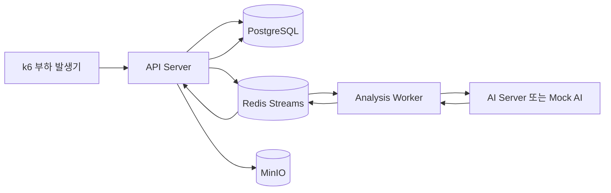
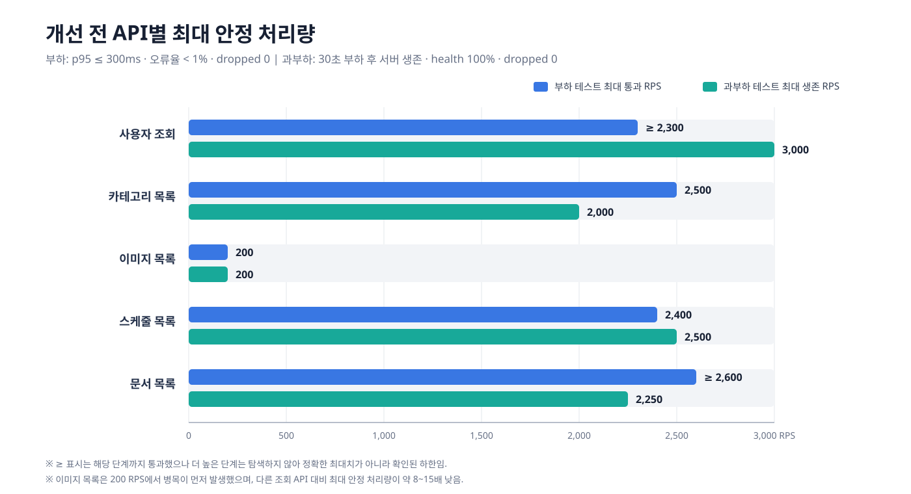
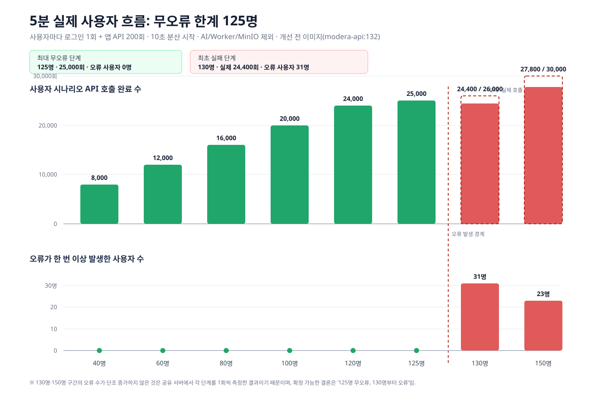

# Modera 개선 전 성능 테스트 종합 보고서

> 기준 버전: 개선 전 API 이미지 `modera-api:132`  
> 작성 목적: API 단위 처리 한계, 백엔드 전체 파이프라인, 실제 사용자 흐름의 병목을 한 문서에서 비교하기 위한 기준선  
> 상태: 측정 완료 결과와 사용자가 중단한 부분 측정을 구분해 기록함

이미지 목록 최적화 후 최신 버전 재측정은 [이미지 목록 최적화 후 성능 재측정](./image-list-optimization-retest.md)에 별도로 기록했다.

## 1. 결론

- 단일 조회 API의 **0.3초 응답 기준 최대 안정 처리량**은 이미지 목록을 제외하면 초당 2,300~2,600건 이상이었다.
- 이미지 목록 API는 **200 RPS**까지만 기준을 통과했다. 250 RPS에서 p95가 119.09ms에서 1.62초로 급증해 가장 명확한 API 병목이었다.
- 30초 과부하 테스트에서 확인한 최대 생존 처리량은 사용자 3,000 RPS, 카테고리 2,000 RPS, 이미지 목록 200 RPS, 스케줄 2,500 RPS, 문서 2,250 RPS였다.
- 실제 앱 사용 패턴으로 사용자별 로그인 1회와 API 200회를 5분간 수행했을 때 **125명·25,000회까지 오류 없이 완료**했다.
- **130명부터 Hikari DB 커넥션 획득 실패**가 발생했다. CPU 포화가 아니라 DB 커넥션 풀과 트랜잭션 진입 구간이 전체 사용자 수용량을 제한했다.
- 로그인 p95는 40명 단계부터 300ms를 초과했고, 130명에서는 7.36초까지 증가했다. 기능 성공 여부와 별개로 로그인은 독립적인 개선 대상이다.
- 비동기 분석 파이프라인은 Mock AI 기준 0.3초 내 완료 가능한 최대 유입이 35 jobs/s였고, 30초 과부하 후 정상 생존 기준은 25 jobs/s였다. 병목은 `analysis-result` 소비와 read model 갱신 구간이었다.
- 실제 AI를 연결한 40명 테스트에서는 Spring API p95가 6.46ms로 낮았지만 AI 컨테이너 CPU와 내부 대기시간이 크게 증가했다. 사용자가 6분 4초에 중단한 부분 결과이므로 최대 처리량 결론으로 사용하지 않는다.

## 2. 테스트 범위와 공통 기준

### 2.1 대상 구성



테스트는 목적에 따라 다음 세 범위로 나눴다.

| 구분 | 포함 대상 | 제외 또는 대체 대상 |
|---|---|---|
| API 단위 테스트 | API Server, PostgreSQL, Redis, 인증 | 실제 사용자 화면 흐름 |
| 전체 분석 파이프라인 | API Server, Redis Streams, Worker, DB, 상태 조회 | 부하 한계 탐색에서는 AI를 Mock으로 대체 |
| 실제 사용자 흐름 | 로그인, 사용자·카테고리·이미지·스케줄·문서 API | 이미지 등록, Worker, MinIO, 실제 AI |
| 실제 AI 파이프라인 검증 | 이미지 등록, MinIO, 이벤트 버스, Worker, 실제 AI, DB | 최대 용량 판정은 하지 않음 |

### 2.2 판정 기준

#### API 부하 테스트

- 비즈니스 요청 p95 ≤ 300ms
- HTTP 오류율 < 1%
- checks 성공률 ≥ 99%
- `dropped_iterations = 0`

#### API 과부하 테스트

- 목표 RPS로 30초 동안 요청
- 이후 45초 동안 health 확인
- health 성공률 100%
- `dropped_iterations = 0`
- 서버와 컨테이너가 정상 상태 유지

#### 5분 실제 사용자 흐름

- 사용자마다 로그인 1회
- 10초 동안 접속을 분산
- 5분 동안 사용자별 시나리오 API 200회
- 평균 호출 간격 약 1.5초
- 응답 지연 시 누락 호출을 몰아서 보내는 catch-up burst 없음
- HTTP 오류 0, 실패 사용자 0, 모든 사용자가 200회 완료해야 통과

## 3. API별 최대 처리량



### 3.1 최종 용량 비교

| API | 대표 요청 | 0.3초 기준 최대 통과 | 30초 최대 생존 | 최초 실패 단계 | 최초 실패 증상 |
|---|---|---:|---:|---:|---|
| 사용자 조회 | `GET /api/v1/user` | ≥ 2,300 RPS | 3,000 RPS | 3,250 RPS | dropped 311 |
| 카테고리 목록 | `GET /api/v1/categories` | 2,500 RPS | 2,000 RPS | 2,250 RPS | dropped 289 |
| 이미지 목록 | `GET /api/v1/images?page=0&size=20` | 200 RPS | 200 RPS | 300 RPS | dropped 1,884, health 96.15% |
| 스케줄 목록 | `GET /api/v1/schedules?page=0&size=20` | 2,400 RPS | 2,500 RPS | 2,750 RPS | dropped 2,691 |
| 문서 목록 | `GET /api/v1/documents?page=0&size=20` | ≥ 2,600 RPS | 2,250 RPS | 2,500 RPS | dropped 190 |

`≥` 표시는 탐색한 마지막 단계까지 통과했지만 그보다 높은 부하를 측정하지 않아 정확한 최대치는 확정하지 못했다는 뜻이다. 따라서 2,300 RPS와 2,600 RPS를 실제 상한으로 해석하면 안 된다.

이미지 목록의 전용 용량 수치는 기준 페이지 조회로 측정했다. 실제 사용자 흐름에서는 `categoryId`를 포함한 카테고리 조회, 정렬, 즐겨찾기, 키워드 조건을 함께 사용했다.

### 3.2 부하 단계별 p95

| API | RPS | p95 | 오류율 | dropped | 판정 |
|---|---:|---:|---:|---:|---|
| 사용자 조회 | 2,000 | 5.15ms | 0% | 0 | 통과 |
| 사용자 조회 | 2,200 | 7.76ms | 0% | 0 | 통과 |
| 사용자 조회 | 2,300 | 8.14ms | 0% | 0 | 통과, 탐색 종료 |
| 카테고리 목록 | 2,200 | 9.71ms | 0% | 0 | 통과 |
| 카테고리 목록 | 2,400 | 13.95ms | 0% | 0 | 통과 |
| 카테고리 목록 | 2,500 | 17.54ms | 0% | 0 | 통과 |
| 카테고리 목록 | 2,600 | 25.25ms | 0% | 60 | 실패 |
| 이미지 목록 | 100 | 22.79ms | 0% | 0 | 통과 |
| 이미지 목록 | 150 | 44.88ms | 0% | 0 | 통과 |
| 이미지 목록 | 200 | 119.09ms | 0% | 0 | 통과 |
| 이미지 목록 | 250 | 1,621.37ms | 0.045% | 781 | 실패 |
| 이미지 목록 | 500 | 2,164.54ms | 0.655% | 8,283 | 실패 |
| 스케줄 목록 | 2,200 | 12.39ms | 0% | 0 | 통과 |
| 스케줄 목록 | 2,400 | 20.58ms | 0% | 0 | 통과 |
| 스케줄 목록 | 2,500 | 33.54ms | 0% | 11 | 실패 |
| 문서 목록 | 2,200 | 12.01ms | 0% | 0 | 통과 |
| 문서 목록 | 2,400 | 22.97ms | 0% | 0 | 통과 |
| 문서 목록 | 2,500 | 20.08ms | 0% | 0 | 통과 |
| 문서 목록 | 2,600 | 28.35ms | 0% | 0 | 통과, 탐색 종료 |

### 3.3 API 병목 해석

#### 이미지 목록

- 200→250 RPS의 25% 부하 증가에서 p95가 약 13.6배 증가했다.
- 실제 처리량은 약 215 RPS 부근에서 더 이상 선형으로 증가하지 않았고, 제안 부하만 높일수록 dropped가 급증했다.
- 다른 조회 API의 안정 처리량보다 약 8~15배 낮아 전체 사용자 흐름에서 가장 먼저 개선할 API다.
- 확인 대상은 조건별 COUNT, 목록 조회 쿼리 실행계획, read model 최신성, 불필요 JOIN, 정렬용 인덱스, 커넥션 점유시간이다.

#### 카테고리·스케줄·문서

- 응답 자체는 낮은 p95를 유지했지만 최초 실패 단계에서 dropped가 발생했다.
- 이는 개별 SQL 지연보다 도착률을 처리할 executor·DB 커넥션·k6 스케줄 여유가 사라진 포화 신호에 가깝다.

#### 사용자 조회·로그인

- 인증 후 사용자 조회는 2,300 RPS 이상에서도 매우 빨랐다.
- 반면 실제 사용자 흐름의 로그인은 동시 유입 증가에 민감했다. 사용자 조회 성능으로 로그인 성능을 대체 평가하면 안 된다.

## 4. 전체 비동기 분석 파이프라인

### 4.1 Mock AI를 사용한 용량 측정

Mock AI는 토큰을 사용하지 않으면서 다음 실제 백엔드 구간을 모두 통과하도록 구성했다.

1. API의 이미지 분석 작업 등록
2. Redis `image-analysis` 이벤트 발행
3. Worker 소비와 처리
4. `analysis-result` 이벤트 발행
5. API 소비
6. DB/read model 갱신
7. 상태 완료 확인

| 테스트 | 최대 통과 | 통과 단계 결과 | 최초 실패 | 실패 결과 |
|---|---:|---|---:|---|
| 0.3초 부하 기준 | 35 jobs/s | p95 279.5ms, 성공 100%, dropped 0 | 40 jobs/s | p95 11.23s, 성공 10.29%, dropped 288 |
| 30초 과부하 후 생존 | 25 jobs/s | p95 270.54ms, 성공 100%, health 45/45, dropped 0 | 26 jobs/s | p95 10.84s, 성공 47.61%, dropped 153 |

40 jobs/s 실패 구간에서 `image-analysis` pending/lag는 0이었지만 `analysis-result`는 pending 9, lag 12까지 증가한 뒤 부하 종료 후 해소됐다. 따라서 Worker가 분석 요청을 받는 앞단보다 **결과 이벤트 소비와 API read model 갱신 구간**이 병목이었다.

### 4.2 실제 AI 소규모·다중 이미지 결과

| 조건 | 결과 |
|---|---|
| 1명, 이미지 1장 | 전체 31.19s, 로그인 440ms, 등록 293ms, 업로드 55ms, 실제 분석 30.37s, 목록 21ms, 상세 12ms, 성공 100% |
| 2명, 이미지 5장 | 전체 평균 11.64s, p95 14.04s, AI 평균 11.25s |
| 5명, 이미지 20장 | 전체 평균 22.50s, 중앙값 13.48s, p95 약 1분 33초, 최대 약 1분 40초 |

이미지 수와 동시 사용자가 증가할수록 API·업로드 시간이 아니라 AI 처리 대기시간의 꼬리가 길어졌다. 일부 요청에서는 AI gRPC timeout/DNS 오류도 관찰됐다.

### 4.3 실제 AI 40명 테스트 — 중단된 부분 결과

사용자 요청으로 6분 4초에 중단했으므로 아래 값은 병목 관찰용이며, 용량 합격·실패 판정이나 최대 처리량으로 사용하지 않는다.

| 항목 | 중단 시점 결과 |
|---|---:|
| 계획 이미지 | 160장 |
| MinIO 업로드 완료 | 155장 |
| 분석 완료 관찰 | 61장 |
| 분석 실패 / timeout | 1 / 0 |
| 완전히 기록된 사용자 흐름 | 8명 |
| 기록된 흐름 성공 | 7/8 |
| 진행 중 사용자 | 32명 |
| 실제 분석 평균 / 중앙값 | 1분 53초 / 1분 55초 |
| 실제 분석 p90 / p95 / 최대 | 3분 8초 / 3분 41초 / 4분 14초 |
| 전체 흐름 평균 / p95 / 최대 | 1분 46초 / 3분 43초 / 4분 22초 |
| HTTP 요청 | 19,598건, 평균 53.83 RPS |
| HTTP 오류 / 비즈니스 p95 | 0 / 6.46ms |

중단 시점 자원 스냅샷은 API 15.46% CPU·682.2MiB, Worker 4.25%·547.5MiB, AI 63.45%·2.274GiB, PostgreSQL 2.60%·180MiB, Redis 0.64%·16.34MiB, MinIO 1.17%·304.5MiB였다. Spring 서버가 아니라 실제 AI의 연산과 내부 큐가 전체 완료시간을 지배했다.

## 5. 실제 사용자 흐름 수용량



### 5.1 시나리오 구성

40개 사용자 프로필은 모두 로그인부터 시작하며, 같은 사용자가 반복 로그인하지 않는다. 각 프로필은 시작 화면과 행동 비율을 달리하되 다음 앱 이동을 조합했다.

- 사용자 정보 → 카테고리 → 최근 이미지 → 이미지 상세
- 카테고리 → 이미지 1·2페이지 → 이미지 상세
- 키워드 검색 → 상세 → 유사 이미지 → 즐겨찾기 목록
- 최신·과거·제목순 갤러리 → 이미지 상세
- 일정 목록 → 캘린더 미등록 일정 → 이미지 목록
- 문서 목록 → 문서 상세 → 문서 구성 이미지

이미지 목록 호출에는 실제 앱 조건을 반영해 `categoryId`를 포함했고 정렬, 키워드, 즐겨찾기 필터를 골고루 사용했다.

### 5.2 단계별 결과

| 동시 사용자 | 계획 시나리오 호출 | 실제 시나리오 호출 | 오류 요청 | 오류 사용자 | 완전 성공 사용자 | 비즈니스 p95 | 로그인 p95 | 전체 RPS | 판정 |
|---:|---:|---:|---:|---:|---:|---:|---:|---:|---|
| 40 | 8,000 | 8,000 | 0 | 0 | 40 | 18.246ms | 391.000ms | 26.053 | 통과 |
| 60 | 12,000 | 12,000 | 0 | 0 | 60 | 22.926ms | 558.513ms | 38.554 | 통과 |
| 80 | 16,000 | 16,000 | 0 | 0 | 80 | 23.114ms | 2,056.741ms | 51.063 | 통과 |
| 100 | 20,000 | 20,000 | 0 | 0 | 100 | 23.136ms | 1,713.546ms | 63.615 | 통과 |
| 120 | 24,000 | 24,000 | 0 | 0 | 120 | 23.286ms | 3,309.120ms | 76.058 | 통과 |
| **125** | **25,000** | **25,000** | **0** | **0** | **125** | **25.963ms** | **3,379.272ms** | **79.210** | **최대 무오류 확인** |
| **130** | **26,000** | **24,400** | **31** | **31** | **99** | **23.298ms** | **7,362.800ms** | **77.237** | **최초 실패** |
| 150 | 30,000 | 27,800 | 24 | 23 | 127 | 24.368ms | 6,470.432ms | 88.041 | 실패 |

실제 시나리오 호출 수에는 로그인 1회를 포함하지 않았다. 로그인까지 포함한 비즈니스 요청은 130명 단계 24,530건, 150명 단계 27,950건이다.

130명 단계에서는 로그인 실패 8명으로 122명만 본 흐름을 완료했고, 로그인 후 흐름에서도 추가 실패가 발생해 완전 성공 사용자는 99명이었다. 150명 단계에서는 로그인 실패 11명으로 139명이 본 흐름을 완료했고 완전 성공 사용자는 127명이었다.

130명보다 150명의 오류 사용자가 적은 것은 용량이 회복됐다는 뜻이 아니다. 공유 서버에서 각 단계를 1회 측정했고 순간 커넥션 경쟁과 백그라운드 부하가 달랐기 때문이다. 재현 측정 전 확정 가능한 경계는 **125명 무오류, 130명부터 오류 발생**이다.

### 5.3 사용자 흐름 병목

130명 이상에서 주된 오류는 다음 계열이었다.

```text
CannotCreateTransactionException
SQLTransientConnectionException
HikariPool connection acquisition timeout
```

확인된 Hikari 풀 크기는 총 20개였고, 실패 로그에서는 약 3.2초 동안 커넥션을 얻지 못한 요청이 관찰됐다. 같은 구간에서 API CPU는 13~16% 수준이었으므로 CPU 부족이 아니라 **동시에 열린 트랜잭션 수와 DB 커넥션 대기**가 수용량을 결정했다.

| 동시 사용자 | API CPU 관찰값 | PostgreSQL CPU 관찰값 | 해석 |
|---:|---:|---:|---|
| 40 | 4.06% | 15.41% | 충분한 여유 |
| 60 | 15.29% | 23.98% | 정상 |
| 80 | 10.23% | 22.17% | 정상 |
| 100 | 10.44% | 22.79% | 정상 |
| 120 | 11.87% | 24.98% | 정상 |
| 125 | 8.29% | 33.38% | 무오류 한계 |
| 130 | 13.24% | 29.36% | DB 커넥션 오류 31건 |
| 150 | 15.65% | 45.63% | DB 커넥션 오류 지속 |

전체 비즈니스 p95가 25ms 안팎으로 낮은데도 사용자가 실패한 이유는 성공한 다수의 빠른 조회가 p95를 지배하기 때문이다. 소수의 커넥션 획득 실패와 긴 로그인 지연은 전체 p95 하나만 보면 가려진다. 따라서 발표와 재측정에서는 전체 p95, 로그인 p95, 오류 사용자 수, DB 커넥션 대기를 함께 제시해야 한다.

## 6. 기존 짧은 혼합 시나리오와의 차이

기존 테스트에서는 6~12개 API 호출을 짧게 반복하고 think time을 0.3초로 둔 고밀도 시나리오를 사용했다.

| VU | 완료 반복 | HTTP RPS | p95 | 오류율 | 판정 |
|---:|---:|---:|---:|---:|---|
| 100 | 10,631 | 318.58 | 20.57ms | 0% | 통과 |
| 200 | 20,632 | 618.26 | 52.08ms | 0% | 통과 |
| 300 | 26,516 | 787.55 | 178.66ms | 0% | 통과 |
| 350 | 26,383 | 788.61 | 285.74ms | 0% | 통과 |
| 375 | 26,191 | 783.55 | 332.79ms | 0% | 실패 |
| 400 | 26,489 | 792.67 | 361.13ms | 0% | 실패 |

이 테스트의 350 VU는 “실제 사용자 350명을 5분간 수용한다”는 의미가 아니다. 짧은 반복 시나리오에서 p95 300ms를 만족한 동시 실행기 수다. 발표용 사용자 수용량은 로그인 1회와 200회 호출을 반영한 **125명 무오류 결과**를 사용한다.

## 7. 개선 우선순위와 재검증 지표

### 1순위 — DB 커넥션 획득 실패 제거

- API 인스턴스 수, DB `max_connections`, Hikari `maximumPoolSize`를 함께 산정한다.
- 트랜잭션 범위를 축소하고 외부 I/O·불필요 반복 쿼리를 트랜잭션 밖으로 이동한다.
- `hikaricp.connections.active`, `pending`, `timeout`, 커넥션 보유시간을 Grafana에 고정한다.
- 풀 크기만 크게 올리면 PostgreSQL 경합이 커질 수 있으므로 125→130→150명 재검증으로 결정한다.

### 2순위 — 이미지 목록 쿼리 개선

- 일반 카테고리 목록의 `totalElements`는 `user_category_view.image_count` 단건 조회를 사용한다.
- favorite·keyword 조건에서는 조건에 맞는 정확한 COUNT를 수행하되 실행계획과 인덱스를 검증한다.
- 응답 구조의 `list`, `page`, `size`, `totalElements`, `hasNext`, `hasPrevious`는 유지한다.
- read model에 필요한 정보가 최신 상태로 저장되는지 확인한 뒤 목록 쿼리의 불필요 JOIN을 제거한다.
- `categoryId`, 정렬, favorite, keyword 조합별 p95와 DB 실행시간을 분리 측정한다.

### 3순위 — 로그인 경로 개선

- 카카오 인증 검증, 사용자 조회·생성, 토큰 발급 시간을 구간별로 계측한다.
- 동시 로그인 시 중복 조회·쓰기, 잠금, 커넥션 점유를 확인한다.
- 전체 API p95와 별도로 로그인 p95 ≤ 300ms를 회귀 기준으로 둔다.

### 4순위 — 분석 결과 소비 확장

- `analysis-result` consumer 처리시간과 pending/lag를 상시 관찰한다.
- read model 갱신의 트랜잭션과 쿼리를 단축한다.
- 멱등성이 보장될 때 consumer 병렬성과 파티션/consumer group 확장을 검토한다.
- 실제 AI 한계와 Spring 파이프라인 한계를 분리해 보고한다.

## 8. 재측정 계획

개선 후에는 같은 스크립트와 데이터로 다음 순서대로 비교한다.

1. 이미지 목록 150→200→250→300 RPS 재측정
2. 나머지 API는 기존 최대 통과점과 최초 실패점을 재측정
3. Mock AI 파이프라인 25→35→40 jobs/s 재측정
4. 실제 사용자 흐름 120→125→130→150명, 단계당 최소 3회 측정
5. 각 단계의 중앙값과 최악값을 함께 기록
6. API p95, 로그인 p95, 오류 사용자, Hikari pending/timeout, PostgreSQL CPU·connection을 동일 시간축으로 비교

목표인 API별 2,000 RPS는 이미지 목록을 제외하면 개선 전에도 충족했다. 이미지 목록은 현재 200 RPS로 목표 대비 10분의 1이며, 먼저 쿼리 구조를 개선한 뒤 2,000 RPS까지 한 번에 올리지 말고 250→300→500→1,000→1,500→2,000 RPS로 단계적으로 확인해야 한다.

## 9. 한계와 해석 주의사항

- k6와 테스트 대상이 같은 물리 서버 자원을 공유했으므로 외부 부하 발생기보다 보수적이거나 변동성이 클 수 있다.
- 실서비스 데이터 분포와 동일하지 않은 고정 테스트 계정·데이터를 사용했다.
- 대부분 단계는 1회 측정이므로 통계적 신뢰구간이 없다.
- `dropped_iterations`는 서버 오류와 다르지만 목표 도착률을 처리하지 못했다는 용량 실패 신호다.
- 실제 AI 40명 테스트는 중단된 부분 결과다.
- 실제 사용자 흐름 용량 테스트는 AI·Worker·MinIO를 제외했다. 125명은 Spring 중심 앱 탐색의 수용량이며 전체 AI 파이프라인을 포함한 수치가 아니다.
- 개선 후 비교 시 서버 사양, 컨테이너 제한, DB 데이터량, 이미지 수, 네트워크 위치를 동일하게 고정해야 한다.

## 10. 재현 자료

| 자료 | 경로 |
|---|---|
| API 부하 스크립트 | `ops/k6/endpoint-load.js` |
| API 과부하 스크립트 | `ops/k6/endpoint-overload.js` |
| 파이프라인 부하 | `ops/k6/pipeline-load.js` |
| 파이프라인 과부하 | `ops/k6/pipeline-overload.js` |
| 40개 사용자 프로필·시나리오 | `ops/k6/mixed-user-scenarios.js` |
| 점진 사용자 용량 실행기 | `ops/k6/run-progressive-user-capacity.sh` |
| 사용자 흐름 실행 가이드 | `ops/k6/USER_FLOW_CAPACITY_TEST.md` |
| 실제 AI 사용자 파이프라인 | `ops/k6/real-ai-user-pipeline.js` |
| 기존 상세 분석 문서 | `docs/performance-test-analysis.md` |
| 기존 혼합 시나리오 문서 | `docs/mixed-user-scenario-test.md` |

이 문서는 위 기존 보고서와 최신 5분·200회 사용자 용량 결과를 합친 **개선 전 통합 기준선**이다.
