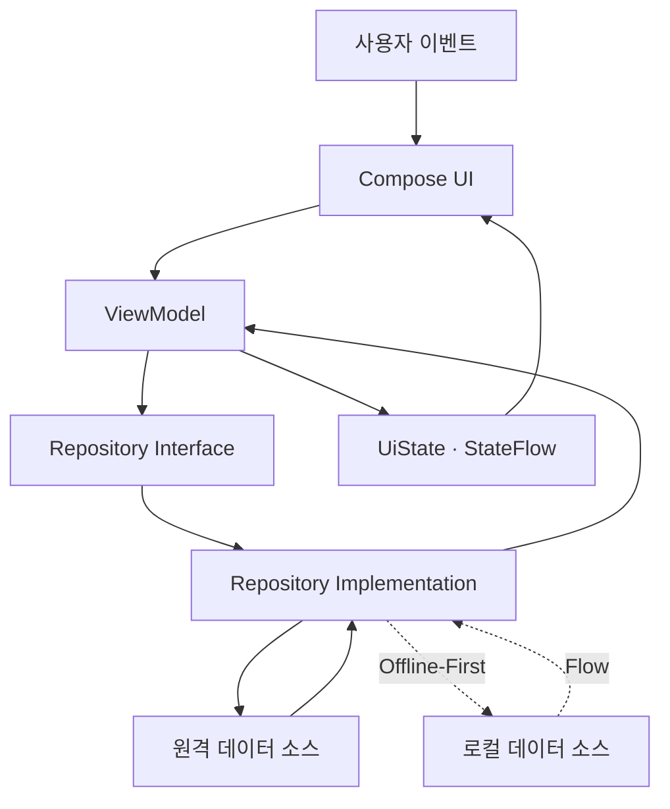
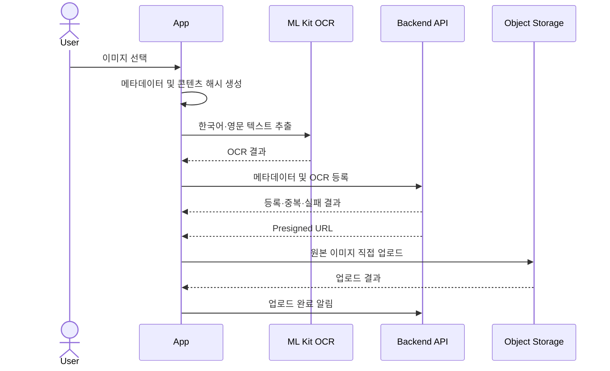
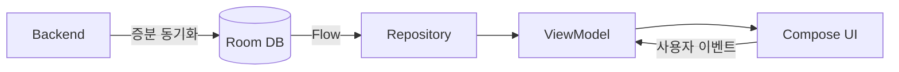

<h1 align="center">Modera</h1>

<p align="center">
  
  
  
  
  
</p>

<p align="center">
  <strong>AI 기반 개인 이미지 아카이브를 위한 Modern Android 프로젝트</strong>
</p>

<p align="center">
  Modera는 사용자 이미지와 OCR·AI 분석 데이터를 다루는 Android 프로젝트입니다.<br/>
  기능 확장, 테스트 용이성, Offline-First 전환을 고려한 아키텍처 설계에 중점을 두고 개발하고 있습니다.
</p>


| 도구 | 역할 |
|---|---|
| JUnit | 단위 테스트 실행 및 결과 검증 |
| Mockito | Network Client 등 외부 의존성 대체 |
| Turbine | Flow에서 방출되는 값과 순서 검증 |
| Coroutine Test | 비동기 작업의 실행 시점 제어 |
| MockWebServer | 실제 서버 없이 HTTP 요청·응답 검증 |
| Robolectric | JVM 환경에서 Android API 의존 코드 테스트 |

> [!IMPORTANT]
> Modera는 현재 개발 중인 프로젝트입니다. UI는 사용자 흐름 검증을 위한 와이어프레임 단계이며,  
> 이 문서는 완성된 서비스 소개보다 프로젝트에 적용한 기술적 의사결정과 확장 방향을 중심으로 작성되었습니다.

---

## 핵심 기술

- **Feature·Core 기반 멀티 모듈**로 기능 간 의존성과 변경 영향 범위 제한
- **MVVM과 단방향 데이터 흐름**을 통한 예측 가능한 UI 상태 관리
- **Navigation 3** 기반 타입 안전한 목적지와 탭별 독립 백스택
- **Convention Plugin**을 통한 모듈별 Gradle 설정 표준화
- **온디바이스 한국어·영문 OCR**을 활용한 이미지 텍스트 추출
- **Presigned URL 직접 업로드**로 백엔드의 이미지 전송 부하 감소
- **Repository·Dispatcher 주입**을 통한 계층별 독립 테스트
- **Room 중심 Offline-First** 구조로 확장 가능한 데이터 계층
- **Compose Design System**을 통한 최종 디자인의 빠른 일괄 적용

---

## 기술 스택 및 오픈소스 라이브러리

- 최소 지원 SDK **26**
- [Kotlin](https://kotlinlang.org/) 기반 Android 애플리케이션
- [Coroutines](https://github.com/Kotlin/kotlinx.coroutines) + Flow
  - 네트워크, OCR, 파일 업로드 등의 비동기 작업 처리
  - `StateFlow` 기반 반응형 UI 상태 관리
- Jetpack
  - **Jetpack Compose**: 선언형 UI와 재사용 가능한 Composable
  - **Lifecycle & ViewModel**: 생명주기를 고려한 화면 상태 관리
  - **Navigation 3**: 타입 기반 화면 이동과 독립 백스택
  - **Material 3 Adaptive**: 다양한 화면 크기에 대응하는 UI 기반
  - **Room**: Offline-First와 로컬 검색을 위한 데이터 저장 기반
  - **Proto DataStore**: 타입 안전한 사용자 설정 저장 기반
- [Hilt](https://dagger.dev/hilt/): 의존성 주입과 객체 생명주기 관리
- [Retrofit](https://square.github.io/retrofit/) + [OkHttp](https://square.github.io/okhttp/)
  - REST API 통신
  - Presigned URL을 이용한 스토리지 직접 업로드
- [Sandwich](https://github.com/skydoves/sandwich): API 응답과 오류 처리 모델링
- [Kotlin Serialization](https://github.com/Kotlin/kotlinx.serialization): JSON 직렬화·역직렬화
- [Coil](https://coil-kt.github.io/coil/): Compose 이미지 로딩과 캐싱
- [ML Kit Text Recognition](https://developers.google.com/ml-kit/vision/text-recognition/v2/android)
  - 한국어·영문 온디바이스 OCR
  - 이미지 분류 및 검색용 텍스트 데이터 생성
- [KSP](https://github.com/google/ksp): Hilt·Room 코드 생성
- 테스트
  - **JUnit & Mockito**: 비즈니스 로직 검증과 테스트 대역 생성
  - [Turbine](https://github.com/cashapp/turbine): Flow 방출 데이터 검증
  - **Coroutine Test**: 비동기 코드 실행 제어
  - **MockWebServer**: 실제 서버 없는 HTTP 통합 테스트
  - **Robolectric**: JVM 환경의 Android 의존 코드 테스트

> [!NOTE]
> Room과 Proto DataStore 모듈은 향후 Offline-First 적용을 위한 기반이 마련된 상태이며,  
> 현재 네트워크 중심 데이터 흐름을 로컬 중심 구조로 전환하고 있습니다.

---

## 아키텍처

Modera는 **MVVM**, **Repository Pattern**, **Unidirectional Data Flow**를 기반으로 구성했습니다.



### UI 계층

UI 계층은 Compose 화면과 ViewModel로 구성됩니다.

- Composable은 상태를 화면에 표현하고 사용자 이벤트를 ViewModel에 전달합니다.
- ViewModel은 Repository의 데이터를 `UiState`로 변환합니다.
- UI는 `StateFlow`를 생명주기에 맞춰 관찰합니다.
- 로딩, 성공, 실패 상태를 명시적으로 모델링합니다.

```text
사용자 이벤트 → ViewModel → UiState → Compose UI
```

이러한 단방향 흐름은 상태가 변경되는 경로를 단순하게 만들고, 화면별 로딩·오류·재시도 처리를 일관되게 유지합니다.

### 데이터 계층

데이터 계층은 Repository, Network Client, DTO·Mapper로 구성됩니다.

- ViewModel은 구체적인 Network Client가 아닌 Repository 인터페이스에 의존합니다.
- Network DTO와 앱 내부 모델을 분리하여 API 변경의 전파 범위를 제한합니다.
- Mapper가 외부 데이터를 애플리케이션 모델로 변환합니다.
- Coroutine Dispatcher를 주입해 실행 환경과 테스트 환경을 분리합니다.

향후에는 Room을 Single Source of Truth로 사용하여 UI가 네트워크 응답 대신 로컬 데이터의 Flow를 관찰하도록 변경할 계획입니다.

---

## 모듈화

```text
modera
├── app
├── build-logic
│
├── feature
│   ├── home
│   ├── categoryimages
│   └── imagedetail
│
└── core
    ├── common
    ├── data
    ├── database
    ├── datastore
    ├── datastore-proto
    ├── designsystem
    ├── domain
    ├── model
    ├── navigation
    └── network
```

### 모듈별 역할

| 모듈 | 역할 |
|---|---|
| `app` | Application 진입점, 최상위 Navigation, 이미지 등록 오케스트레이션 |
| `feature:home` | 카테고리 목록, 정렬, 분석 진행 상태 |
| `feature:categoryimages` | 카테고리별 이미지 탐색과 선택 |
| `feature:imagedetail` | 이미지 및 분석 결과 상세 화면 |
| `core:common` | 공통 Result와 Coroutine Dispatcher |
| `core:model` | 계층과 기능에서 공유하는 애플리케이션 모델 |
| `core:network` | Retrofit API, Network DTO, API Client |
| `core:data` | Repository 인터페이스·구현과 데이터 매핑 |
| `core:database` | Room 기반 로컬 데이터 저장 영역 |
| `core:datastore` | 사용자 설정 저장 영역 |
| `core:datastore-proto` | Protocol Buffers 코드 생성 |
| `core:navigation` | Navigation 상태와 Navigator |
| `core:designsystem` | 디자인 토큰과 공통 Compose 컴포넌트 |
| `build-logic` | 공통 Convention Plugin |

### 모듈화 도입 이유

- **캡슐화**: 모듈이 외부에 노출하는 API를 제한해 잘못된 계층 접근을 방지합니다.
- **확장성**: 새로운 기능을 독립적인 Feature 모듈로 추가할 수 있습니다.
- **병렬 개발**: 팀원이 기능별 작업 영역에 집중할 수 있어 충돌 가능성이 줄어듭니다.
- **재사용성**: 공통 모델, UI, Navigation, 데이터 로직의 중복 구현을 방지합니다.
- **빌드 일관성**: Convention Plugin으로 모든 모듈에 동일한 빌드 규칙을 적용합니다.

---

## 빌드 설정 표준화

멀티 모듈 프로젝트에서 반복되는 Gradle 설정은 `build-logic`의 Convention Plugin으로 관리합니다.

```text
Convention Plugins
├── Android Application
├── Android Library
├── Compose Application
├── Compose Library
├── Feature
├── Hilt
├── Room
└── JVM Library
```

새로운 모듈은 필요한 플러그인만 선언하면 공통 Android·Kotlin·Compose 설정과 기본 의존성을 사용할 수 있습니다. 모듈마다 설정이 달라지는 문제를 줄이고 `build.gradle.kts`가 해당 모듈의 고유한 설정에 집중하도록 했습니다.

---

## 타입 안전한 Navigation

Navigation 3의 `NavKey`를 사용해 문자열 route 대신 타입으로 화면을 정의합니다.

```text
HomeNavKey
    └── CategoryImagesNavKey(categoryId)
            └── ImageDetailNavKey(imageId)
```

- 잘못된 경로나 인자 전달 문제를 컴파일 단계에서 줄입니다.
- 각 최상위 탭이 독립된 Back Stack을 가집니다.
- 탭을 전환한 뒤 돌아와도 기존 탐색 상태가 유지됩니다.
- Navigation Entry의 ViewModel 생명주기와 저장 가능한 UI 상태를 함께 관리합니다.

---

## 이미지 처리 파이프라인

이미지 등록은 OCR, 중복 식별, 스토리지 업로드를 하나의 비동기 흐름으로 처리합니다.



### 온디바이스 OCR

한국어와 영문 Text Recognizer를 기기에서 실행하고 두 결과를 병합합니다. OCR 실패가 전체 이미지 등록 작업을 중단시키지 않도록 이미지별로 독립 처리합니다.

온디바이스 처리를 선택한 이유는 다음과 같습니다.

- OCR을 위한 추가 서버 요청과 연산 비용 감소
- 이미지 등록 전 검색·분류용 텍스트 확보
- 개별 OCR 실패가 전체 일괄 등록에 미치는 영향 제한
- 향후 로컬 검색에 활용 가능한 데이터 생성

### Presigned URL 업로드

원본 이미지는 백엔드를 경유하지 않고 OkHttp로 Object Storage에 직접 업로드합니다.

- 백엔드의 대용량 파일 전송 부하 감소
- 애플리케이션 서버와 파일 저장소의 책임 분리
- 서버 네트워크 비용과 메모리 사용량 완화
- 이미지 업로드 기능의 독립적인 확장 가능

콘텐츠 해시를 메타데이터와 함께 전달하여 서버가 중복 이미지를 식별할 수 있도록 했으며, 등록·중복·실패 결과를 분리해 사용자에게 진행 결과를 제공합니다.

---

## 디자인 시스템

최종 디자인 적용 전부터 공통 UI를 `core:designsystem` 모듈로 분리했습니다.

```text
Design System
├── Design Tokens
│   ├── Color
│   └── Typography
│
└── Components
    ├── Button
    ├── Divider
    ├── Icon
    ├── IconButton
    ├── LoadingWheel
    ├── Navigation
    ├── Scaffold
    ├── Surface
    ├── Tab
    └── Text
```

현재 UI는 와이어프레임 수준이지만 화면이 공통 디자인 토큰과 Composable을 사용하도록 구성했습니다. 최종 시안이 확정되면 화면을 각각 수정하지 않고 디자인 시스템을 중심으로 전체 UI를 빠르게 변경할 수 있습니다.

---

## 테스트 전략

외부 시스템에 의존하지 않고 각 계층을 검증할 수 있도록 테스트 가능한 의존성 구조를 구성했습니다.

```text
운영 환경                         테스트 환경
─────────                         ─────────
Network Client        ←→          Mock / MockWebServer
IO Dispatcher         ←→          Test Dispatcher
Repository Impl       ←→          Repository Unit Test
Flow                  ←→          Turbine
Android Runtime       ←→          Robolectric
```

- Repository가 Network Client를 직접 생성하지 않고 주입받습니다.
- IO Dispatcher를 Qualifier로 주입해 테스트에서 실행 시점을 제어합니다.
- Network Response에서 Application Model로의 변환을 독립적으로 검증합니다.
- Turbine으로 `Loading → Success` 또는 `Loading → Error`와 같은 Flow 방출 순서를 검증할 수 있습니다.

---

## 개발 로드맵

### Offline-First

Modera의 이미지와 분석 결과는 반복 조회되지만 변경 빈도는 비교적 낮습니다. 이 특성을 활용해 Room을 데이터의 **Single Source of Truth**로 사용하는 Offline-First 구조로 전환할 계획입니다.



앱은 로컬 데이터를 먼저 표시하고 서버와는 백그라운드에서 변경 사항만 동기화합니다.

- 앱 실행 직후 로컬 데이터를 빠르게 표시
- 동일한 데이터에 대한 반복 API 요청 감소
- 이미지와 분석 결과의 중복 다운로드 방지
- 불안정한 네트워크에서도 핵심 데이터 조회
- 사용자 증가에 따른 서버 트래픽과 전송 비용 완화
- 온라인·오프라인에서 동일한 데이터 흐름 유지

Offline-First를 단순한 오프라인 지원이 아닌, **서버를 필요한 시점에만 사용하는 운영 비용 최적화 전략**으로 적용하는 것이 목표입니다.

이를 위해 이미지, 카테고리, 태그, OCR 및 분석 결과의 Entity와 관계를 설계하고 DAO를 Repository에 연결합니다. 동기화 과정에서는 네트워크 오류를 로컬 데이터 조회 실패와 분리하고, 실패한 요청을 안전하게 재시도할 수 있도록 동기화 상태를 관리할 예정입니다.

### FTS4 로컬 검색

Room FTS4 검색 인덱스를 구성해 다음 데이터를 통합 검색할 계획입니다.

```text
검색 인덱스
├── 이미지 제목
├── OCR 텍스트
├── AI 분석 결과
├── 태그
└── 카테고리
```

서버 검색 API를 호출하지 않고 로컬에서 결과를 제공하므로 입력에 빠르게 반응하고 오프라인에서도 동작합니다. 데이터가 증가할 때 전체 문자열을 순회하는 `LIKE '%query%'`보다 효율적인 전문 검색을 제공하는 것이 목표입니다.

검색 결과에는 카테고리와 태그 필터, 최신순·관련도순 등의 정렬 조건을 함께 적용하여 데이터가 누적되어도 원하는 이미지를 빠르게 좁힐 수 있도록 구성할 예정입니다.

### WorkManager 기반 백그라운드 이미지 분석

이미지 OCR과 업로드, 서버 분석 요청처럼 즉시 완료되지 않아도 되는 작업은 WorkManager 기반의 작업 큐로 이전할 계획입니다.

```text
이미지 등록
    ↓
분석 작업 큐 등록
    ↓
네트워크 조건 충족
    ↓
OCR · 업로드 · 분석 요청
    ↓
진행 상태 및 결과 저장
```

- 앱이 백그라운드로 전환되거나 프로세스가 종료되어도 예약된 작업 유지
- 네트워크 연결 등 작업 실행 조건 설정
- 일시적인 네트워크·서버 오류 발생 시 재시도 정책 적용
- 이미지별 대기·진행·성공·실패 상태 관리
- 여러 이미지 등록 시 순차 또는 병렬 작업 제어

UI는 WorkManager 자체를 직접 참조하지 않고 Repository를 통해 Room에 저장된 작업 상태를 관찰하도록 구성합니다. 이를 통해 백그라운드 실행 방식이 변경되더라도 화면 계층에 미치는 영향을 제한할 수 있습니다.

### Proto DataStore

정렬 방식, 필터, 자동 분석 여부 등 사용자 설정은 Proto DataStore로 관리할 계획입니다.

- Protocol Buffers 스키마 기반의 타입 안전한 설정
- 문자열 Key와 런타임 타입 변환 제거
- Flow를 통한 설정 변경의 즉각적인 UI 반영
- 새로운 설정 항목을 추가하기 쉬운 확장 구조

### 최종 디자인 적용

사용자 흐름 검증 후 확정된 컬러, 타이포그래피, Shape를 디자인 토큰에 반영하고 공통 Composable을 고도화할 예정입니다. 이미 구축한 디자인 시스템을 활용해 기능 코드 변경을 최소화하면서 전체 화면에 일관된 디자인을 적용합니다.

---

## 개발 현황

| 영역 | 상태 |
|---|---|
| 멀티 모듈 및 Convention Plugin | ✅ 구현 완료 |
| Compose Design System 기반 | ✅ 구현 완료 |
| Navigation 3 타입 기반 이동 | ✅ 구현 완료 |
| 카테고리·이미지 상세 조회 | ✅ 구현 완료 |
| ML Kit 온디바이스 OCR | ✅ 구현 완료 |
| Presigned URL 이미지 업로드 | ✅ 구현 완료 |
| Repository·Network 테스트 | ✅ 구현 완료 |
| Room Offline-First | 🚧 개발 중 |
| FTS4 로컬 검색 | 📌 개발 예정 |
| WorkManager 백그라운드 이미지 분석 | 📌 개발 예정 |
| Proto DataStore 사용자 설정 | 📌 개발 예정 |
| 최종 UI 디자인 | 📌 개발 예정 |

---

## 빌드

### 개발 환경

- Android Studio
- JDK 17+
- Android SDK 36
- 최소 지원 버전: Android 8.0 (API 26)

### 프로젝트 빌드

```bash
./gradlew assembleDebug
```

Windows:

```powershell
.\gradlew.bat assembleDebug
```

### 테스트 실행

```bash
./gradlew test
```

> [!NOTE]
> 현재 API Base URL은 `core:network` 모듈의 개발 서버 설정을 사용합니다.  
> 서버 운영 상태에 따라 네트워크 기반 기능의 실행 결과가 달라질 수 있습니다.

---

## 프로젝트에서 보여주고자 한 것

Modera는 완성된 화면의 수보다, 사용자 데이터가 축적되는 Android 앱을 어떻게 확장 가능하게 설계할 것인지에 초점을 맞춘 프로젝트입니다.

- 기능 증가에 대응할 수 있는 모듈 경계 설계
- UI와 데이터 출처를 분리한 Repository 구조
- StateFlow 기반의 예측 가능한 상태 관리
- 타입 안전성과 사용자 상태 보존을 고려한 Navigation
- 클라이언트 OCR과 스토리지 직접 업로드를 통한 서버 비용 최적화
- 로컬 데이터를 중심으로 확장 가능한 Offline-First 전략
- 디자인 변경 비용을 줄이는 Compose Design System
- 실제 서버 없이 검증할 수 있는 테스트 구조

현재 구조를 기반으로 데이터가 증가해도 빠르게 탐색할 수 있고, 네트워크 환경에 덜 의존하며, 서버 운영 비용을 효율적으로 관리할 수 있는 개인 이미지 아카이브로 발전시키고 있습니다.
